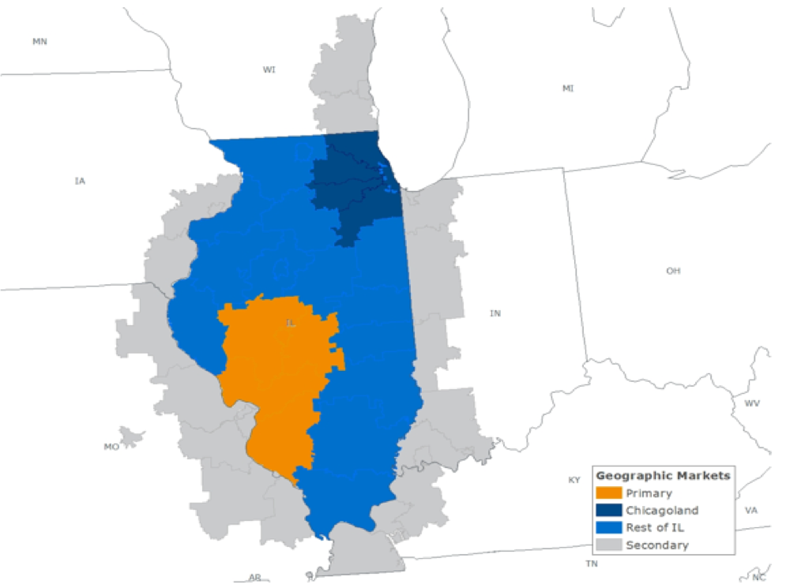

```{r setup, include=FALSE}
knitr::opts_chunk$set(echo = TRUE, warning = FALSE, message = FALSE)
options(tibble.width = Inf, width = 10000, scipen = 999)

library(tidyverse)

load(url('https://github.com/mpatricia01/public_requests_eda/raw/main/data/148654_uis_orders.RData'))
```

<style>
pre code, pre, code {
  white-space: pre !important;
  overflow-x: auto !important;
  word-break: keep-all !important;
  word-wrap: initial !important;
}
</style>

{width=80%}


# Primary market purchases (59 orders)

```{r}
primary_orders
```

Generally, on each purchase date, they make **4-6 orders by SAT or PSAT score ranges** (**SAT** if purchasing _seniors_, **PSAT** if purchasing _juniors_ or _sophomores_):

- **Senior purchases** by **SAT** filter
  - **Dec 2018** (_grad class 2019_): 4 groups (A1, B, C, D)
  - **May 2019** (_grad class 2020_): 4 groups (A1, B, C, D)
  - **Oct 2019** (_grad class 2020_): 5 groups (A2, B, C, D, E)
  - **Mar 2020** (_grad class 2020_): 4 groups (A2, B, C, D)
  - **May 2020** (_grad class 2021_): 4 groups (A2, B, C, D)
- **Junior purchases** by **PSAT** filter
  - **Jan 2019** (_grad class 2020_): 5 groups (B, C, D, E, F)
  - **Oct 2019** (_grad class 2021_): 6 groups (A, B, C, D, E, F)
  - **Jan 2020** (_grad class 2021_): 5 groups (B, C, D, E, F)
- **Sophomore purchases** by **PSAT** filter
  - **Jan 2019** (_grad class 2021_): 6 groups (A, B, C, D, E, F)
  - **Oct 2019** (_grad class 2022_): 5 groups (A, B, C, D, E)
  - **Jan 2020** (_grad class 2022_): 6 groups (A, B, C, D, E, F)
  - **May 2020** (_grad class 2022_): 5 groups (A, C, D, E, F)

```{r}
# Same for Primary, Chicagoland, and Rest of IL markets
distinct(primary_orders %>% select(sat_score_min, sat_score_max, psat_score_min, psat_score_max)) %>% 
  arrange(sat_score_min, psat_score_min) %>%
  add_column(score_range = c('A1', 'A2', 'B', 'C', 'D', 'E', 'A', 'B', 'C', 'D', 'E', 'F'), .before = 1)
```

**Common filters**:

- **GPA**: A+ to B-

**General observations**:

- Test score seems to be only differing filter used. Maybe the university doesn't have access to student-level test scores, so they make separate purchases to be able to identify and target these specific groups?
- Junior and Sophomore purchases both use PSAT score range filters, but Juniors tend to use higher test score ranges (stricter requirement)
- Test score ranges (categories) remain largely unchanged over time, except the minimum score for lowest SAT category increased (A1 to A2)


# Chicagoland market purchases (54 orders)

```{r}
chicagoland_orders
```

Similarly, on each purchase date, they make **order(s) by SAT or PSAT score ranges** (**SAT** if purchasing _seniors_, **PSAT** if purchasing _juniors_ or _sophomores_):

- **Senior purchases** by **SAT** filter
  - **Dec 2018** (_grad class 2019_): 4 groups (A1, B, C, D)
  - **May 2019** (_grad class 2020_): 4 groups (A1, B, C, D)
  - **Oct 2019** (_grad class 2020_): 5 groups (A2, B, C, D, E)
  - **Mar 2020** (_grad class 2020_): 5 groups (A2, B, C, D, E)
  - **May 2020** (_grad class 2021_): 5 groups (A2, B, C, D, E)
- **Junior purchases** by **PSAT** filter
  - **Jan 2019** (_grad class 2020_): 5 groups (B, C, D, E, F)
  - **Oct 2019** (_grad class 2021_): 6 groups (A, B, C, D, E, F)
  - **Jan 2020** (_grad class 2021_): 1 group (B)
- **Sophomore purchases** by **PSAT** filter
  - **Jan 2019** (_grad class 2021_): 6 groups (A, B, C, D, E, F)
  - **Oct 2019** (_grad class 2022_): 6 groups (A, B, C, D, E, F)
  - **Jan 2020** (_grad class 2022_): 1 group (A)
  - **May 2020** (_grad class 2022_): 6 groups (A, B, C, D, E, F)

```{r}
# Same for Primary, Chicagoland, and Rest of IL markets
distinct(chicagoland_orders %>% select(sat_score_min, sat_score_max, psat_score_min, psat_score_max)) %>% 
  arrange(sat_score_min, psat_score_min) %>%
  add_column(score_range = c('A1', 'A2', 'B', 'C', 'D', 'E', 'A', 'B', 'C', 'D', 'E', 'F'), .before = 1)
```

**Common filters**:

- **GPA**: A+ to B-


# Rest of IL market purchases (30 orders)

```{r}
rest_of_IL_orders
```

Similarly, on each purchase date, they make **order(s) by SAT or PSAT score ranges** (**SAT** if purchasing _seniors_, **PSAT** if purchasing _juniors_ or _sophomores_):

- **Senior purchases** by **SAT** filter
  - **Dec 2018** (_grad class 2019_): 4 groups (A1, B, C, D)
  - **May 2019** (_grad class 2020_): 4 groups (A1, B, C, D)
  - **Oct 2019** (_grad class 2020_): 5 groups (A2, B, C, D, E)
  - **Mar 2020** (_grad class 2020_): 5 groups (A2, B, C, D, E)
  - **May 2020** (_grad class 2021_): 5 groups (A2, B, C, D, E)
- **Junior purchases** by **PSAT** filter
  - **Oct 2019** (_grad class 2021_): 1 group (A)
- **Sophomore purchases** by **PSAT** filter
  - **May 2020** (_grad class 2022_): 6 groups (A, B, C, D, E, F)

```{r}
# Same for Primary, Chicagoland, and Rest of IL markets
distinct(rest_of_IL_orders %>% select(sat_score_min, sat_score_max, psat_score_min, psat_score_max)) %>% 
  arrange(sat_score_min, psat_score_min) %>%
  add_column(score_range = c('A1', 'A2', 'B', 'C', 'D', 'E', 'A', 'B', 'C', 'D', 'E', 'F'), .before = 1)
```

**Common filters**:

- **GPA**: A+ to B-

**General observations**:

- Mostly seniors purchased over juniors/sophomores


# Secondary market purchases (17 orders)

```{r}
secondary_orders
```

Similarly, on each purchase date, they make **order(s) by SAT or PSAT score ranges** (**SAT** if purchasing _seniors_, **PSAT** if purchasing _juniors_):

- **Senior purchases** by **SAT** filter
  - **Dec 2018** (_grad class 2019_): 2 groups (C, D)
  - **May 2019** (_grad class 2020_): 2 groups (C, D)
  - **Oct 2019** (_grad class 2020_): 6 groups (A, B, C, D, E, F)
  - **May 2020** (_grad class 2021_): 6 groups (A, B, C, D, E, F)
- **Junior purchases** by **PSAT** filter
  - **Oct 2019** (_grad class 2021_): 1 group (A)

```{r}
# Higher standards than markets above
distinct(secondary_orders %>% select(sat_score_min, sat_score_max, psat_score_min, psat_score_max)) %>% 
  arrange(sat_score_min, psat_score_min) %>%
  add_column(score_range = c('A', 'B', 'C', 'D', 'E', 'F', 'A'), .before = 1)
```

**Common filters**:

- **GPA**: A+ to B

**General observations**:

- This market include out-of-state zip codes bordering IL
- Most purchases are for seniors except 1 order for juniors
- Both test score and GPA requirements are stricter for this market than the IL markets


# Other market purchases (28 orders)

```{r}
other_orders
```

**MISSING zip_code_files - CURRENTLY REQUESTING**

**Other filters**:

- **GPA**: A+ to A- **OR** A+ to C
