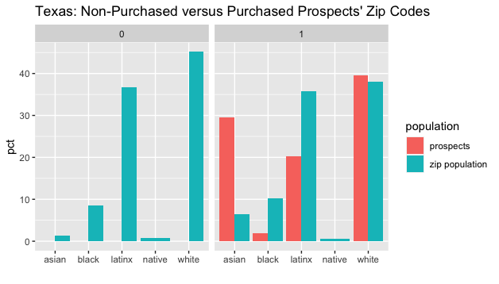
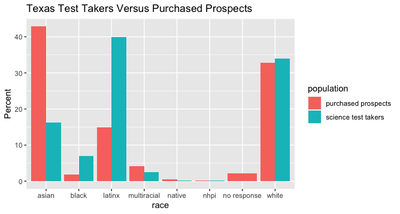

```{r setup, include=FALSE}
options(knitr.kable.NA = '')
options(scipen=999)
knitr::opts_chunk$set(echo = F, message = F, warning = F)
# webshot::install_phantomjs()

library(knitr)
library(bookdown)
library(tidyverse)
library(gridExtra)
library(kableExtra)
library(scales)
library(english)
library(usmap)
library(leaflet)
library(rgdal)

data_dir <- file.path('..', '..', 'data')

load(file.path(data_dir, 'tbl_fig_data.RData'))
load(file.path(data_dir, 'tbl_fig_data_final.RData'))

zip_shp <- readOGR(file.path(data_dir, 'cb_2018_us_zcta510_500k', 'cb_2018_us_zcta510_500k.shp'))

theme_set(
  theme(
    text = element_text(size = 7),
    panel.background = element_blank(),
    plot.title = element_text(color = '#444444', size = 7, face = 'bold', hjust = 0.5),
    axis.ticks = element_blank(),
    axis.title = element_text(face = 'bold'),
    legend.title = element_text(face = 'bold'),
    legend.key.size = unit(0.3, 'cm'),
    strip.text.x = element_text(size = 7, face = 'bold', hjust = 0.5),
    strip.background = element_rect(fill = NA, color = NA)
  )
)

color_palette <- c('#bbcfd7', '#d2c8bc', '#ba9a88')

# https://stackoverflow.com/a/65844319/6373540
linesep <- function(x, y = character()){
  if(!length(x))
    return(y)
  linesep(x[-length(x)], c(rep('', x[length(x)] - 1), '\\addlinespace', y))  
}

num_orders <- nrow(orders_df)
num_orders_w_list <- sum(orders_df$order_num %in% lists_df_summary$ord_num)
num_orders_no_list <- num_orders - num_orders_w_list
num_univs_orders <- length(unique(orders_df$univ_id))

num_lists <- length(na.omit(lists_df_summary$ord_num))
num_univs_lists <- length(unique(lists_df_summary$univ_id))

num_prospects <- sum(lists_df_summary$n)
num_prospects_w_order <- sum((lists_df_summary %>% filter(ord_num %in% orders_df$order_num))$n)
num_prospects_no_order <- sum((lists_df_summary %>% filter(!ord_num %in% orders_df$order_num))$n)

# RQ1
num_univs_orders_research <- sum(orders_prospects_purchased$univ_type == 'research')
num_univs_orders_regional <- sum(orders_prospects_purchased$univ_type == 'regional')

num_orders_research <- sum((orders_prospects_purchased %>% filter(univ_type == 'research'))$total_orders)
num_orders_regional <- sum((orders_prospects_purchased %>% filter(univ_type == 'regional'))$total_orders)


df_0 <- df_0 %>% 
  mutate(pct = round(n / sum(n) * 100))

df_rq2a_totals <- df_rq2a %>% filter(row_subj == 'Total N')
df_rq2a_domestic <- df_rq2a %>% select(row_subj, all_domestic) %>% column_to_rownames('row_subj') %>% t() %>% as.data.frame()
df_rq2a_instate <- df_rq2a %>% select(row_subj, in_state) %>% column_to_rownames('row_subj') %>% t() %>% as.data.frame()
df_rq2a_outofstate <- df_rq2a %>% select(row_subj, out_of_state) %>% column_to_rownames('row_subj') %>% t() %>% as.data.frame()
df_rq2a_research_instate <- df_rq2a %>% select(row_subj, research_univ_instate) %>% column_to_rownames('row_subj') %>% t() %>% as.data.frame()
df_rq2a_research_outofstate <- df_rq2a %>% select(row_subj, research_univ_outofstate) %>% column_to_rownames('row_subj') %>% t() %>% as.data.frame()
df_rq2a_regional_instate <- df_rq2a %>% select(row_subj, regional_univ_instate) %>% column_to_rownames('row_subj') %>% t() %>% as.data.frame()
df_rq2a_regional_outofstate <- df_rq2a %>% select(row_subj, regional_univ_outofstate) %>% column_to_rownames('row_subj') %>% t() %>% as.data.frame()

df_rq3_gpa <- df_rq3 %>% select(row_subj, GPA) %>% column_to_rownames('row_subj') %>% t() %>% as.data.frame()
df_rq3_psat <- df_rq3 %>% select(row_subj, PSAT) %>% column_to_rownames('row_subj') %>% t() %>% as.data.frame()
df_rq3_sat <- df_rq3 %>% select(row_subj, SAT) %>% column_to_rownames('row_subj') %>% t() %>% as.data.frame()
df_rq3_hsrank <- df_rq3 %>% select(row_subj, `HS RANK`) %>% column_to_rownames('row_subj') %>% t() %>% as.data.frame()
df_rq3_race <- df_rq3 %>% select(row_subj, RACE) %>% column_to_rownames('row_subj') %>% t() %>% as.data.frame()
df_rq3_gender <- df_rq3 %>% select(row_subj, GENDER) %>% column_to_rownames('row_subj') %>% t() %>% as.data.frame()
df_rq3_zip <- df_rq3 %>% select(row_subj, ZIP) %>% column_to_rownames('row_subj') %>% t() %>% as.data.frame()
df_rq3_state <- df_rq3 %>% select(row_subj, STATE) %>% column_to_rownames('row_subj') %>% t() %>% as.data.frame()
df_rq3_segment <- df_rq3 %>% select(row_subj, SEGMENT) %>% column_to_rownames('row_subj') %>% t() %>% as.data.frame()
df_rq3_cbsa <- df_rq3 %>% select(row_subj, CBSA) %>% column_to_rownames('row_subj') %>% t() %>% as.data.frame()
```


<!-- # Executive Summary -->

<!-- TEXT -->

# Introduction

In March 2020, a selective public research university purchased 45 "student lists" from The College Board. These lists contain demographic and contact information of prospective students that is collected when they complete assessments administered by the College Board. This information is purchased and then used by universities to recruit prospective students using mail, email, text messages, and other marketing interventions. 

Several of the student lists purchased by the university targeted women in STEM fields. For example, an order the university named "NR 2021 Female AP STEM" targeted nonresident high school students from 26 states, who identified as women, were in the high school class of 2021, had an average high school GPA ranging from B to A+, and received a 4 or higher on an AP exam in a STEM subject (e.g., calculus, biology, chemistry, computer science, statistics). Another order titled "NR 2021 Female SAT STEM" utilized similar "search filters." However, the AP exam search filter was replaced by two filters: an SAT score between 1300 and 1600; and expressing interest in one or more STEM majors.

<!-- 
orders_df_110680 %>% filter(gender == 'Female',is.na(ap_scores)==0) %>% View()
orders_df_110680 %>% filter(order_num %in% c('560003','560079','560099','560102','560103','560107')) %>% View()
orders_df_110680 %>% filter(gender == 'Female',is.na(ap_scores)==1) %>% View()
-->

Research universities often purchase lists of female high school students -- those who take STEM AP exams or those with SAT scores within some range who also express interest in a STEM major and -- in order to overcome the under-representation of women in STEM degree programs. However, analyses of the prospects purchased by "women in STEM" orders suggests that efforts to solve inequities in one domain may lead to other problematic inequities. 

Figure \@ref(fig:women-in-stem) shows the average racial and economic characteristics of the 12,938 prospects whose contact information was purchased across 11 total orders made by the university targeting women in STEM. These prospects live in zip codes where the average median household income is \$109,000. Figure \@ref(fig:women-in-stem) also shows very few prospects whose information were purchased are Latinx (6%), Black (2%), Multiracial (5%), or Native American students (0.1%); whereas White (52%) and Asian (32%) students make up more than 8 of every 10 women in STEM prospects.

```{r women-in-stem, fig.height = 1.5, fig.cap = 'Women in STEM prospects, average income and racial composition'}
ucsd_income_figure <- ucsd_all %>% 
  summarise(
    income_2564 = mean(medincome_2564, na.rm = T)
  ) %>% 
  mutate(
    count_type = 'all'
  ) %>% 
  ggplot(aes(y = count_type, x = income_2564)) + 
  geom_bar(stat = 'identity', fill = color_palette[[2]], width = 0.5) + 
  geom_text(mapping = aes(label = str_c('$', round(income_2564 / 1000), 'K')), size = 2, hjust = -0.1) +
  scale_x_continuous(expand = expansion(mult = c(0, 0.04)), limits = c(0, 130000)) +
  # scale_y_discrete(expand = expansion(mult = c(0.01, 0.1))) +
  xlab('') + ylab('') +
  guides(fill = guide_legend(reverse = T)) +
  theme(
    # plot.background = element_rect(color = 'gray'),
    # panel.background = element_rect(color = 'red'),
    axis.text.x = element_blank(),
    axis.text.y = element_blank()
  )

ucsd_race_figure_data <- ucsd_all %>% 
  group_by(race) %>% 
  summarise(
    count = n()
  ) %>% 
  mutate(
    pct = count / sum(count)
  ) %>% 
  ungroup() %>% 
  mutate(
    race = recode_factor(
      race,
      'missing' = 'Missing',
      'noresponse' = 'No response',
      'other' = 'Other',
      'tworaces' = 'Multiracial',
      'nativehawaii' = 'NH/PI',
      'amerindian' = 'AI/AN',
      'hispanic' = 'Latinx',
      'black' = 'Black',
      'asian' = 'Asian',
      'white' = 'White'
    ),
    count_type = 'all'
  ) %>% 
  filter(!race %in% c('No response', 'Missing'))

ucsd_race_figure_totals <- ucsd_race_figure_data %>% 
  group_by(count_type) %>% 
  summarise(
    count = sum(count)
  ) %>% 
  ungroup()
  
ucsd_race_figure <- ucsd_race_figure_data %>% 
  ggplot(aes(y = count_type, x = pct, fill = race)) + 
  geom_bar(position = 'stack', stat = 'identity', alpha = 0.4, width = 0.5) + 
  geom_text(mapping = aes(label = if_else(pct > 0.02, as.character(round(pct * 100)), '')), size = 2, position = position_stack(vjust = 0.5)) +
  geom_text(data = ucsd_race_figure_totals, mapping = aes(x = 1, fill = NULL, label = str_c('N=', prettyNum(count, big.mark = ','))), size = 2, hjust = -0.1) +
  scale_fill_brewer(palette = 'BrBG', direction = -1, name = 'Race') +
  scale_x_continuous(expand = expansion(mult = c(0, 0.04)), limits = c(0, 1.14)) +
  # scale_y_discrete(expand = expansion(mult = c(0.01, 0.1))) +
  xlab('') + ylab('') +
  guides(fill = guide_legend(reverse = T)) +
  theme(
    # plot.background = element_rect(color = 'gray'),
    # panel.background = element_rect(color = 'red'),
    axis.text.x = element_blank(),
    axis.text.y = element_blank(),
    plot.margin = unit(c(5.5, 0, 5.5, 2), 'pt')
  )

grid.arrange(
  ucsd_income_figure,
  ucsd_race_figure,
  ncol = 2,
  widths = c(2, 3)
)
```


Efforts to increase representation of women in STEM by purchasing lists from College Board (or ACT) is likely to yield racial and socioeconomic inequality for two reasons. First, universities cannot purchase the contact information of prospects who are not included in the underlying database of test-takers. Exclusion from the database is a function of socioeconomic and racial disparities in access to AP coursework [@RN6014; @RN6015; @RN6017; @RN6016; @RN6018; @RN6020] and SAT/PSAT test-taking [@RN6021].^[FOOTNOTE; ACT NRCCUA].

<!--  CUT TEXT

Exclusion from the database is a function of socioeconomic and racial disparities in access to AP coursework [CITE] and SAT/PSAT test-taking [@RN0006].^[FOOTNOTE; ACT NRCCUA] Low-income students and Students of Color are less likely to attend high schools that offer AP curricula [CITE] and complete the SAT at considerably lower rates than White and affluent students [CITE].
-->

Second, the "search filters" on student list products enable universities to control which prospects are included in a purchase. Although universities choose filters based on their preferences, these choices are structured by what the product allows. Several search filters (e.g., zip-code, AP exam score, "geodemographic" segment) may yield systematic racial, socioeconomic, and/or geographic inequality in which prospective students are recruiting by universities.

<!--  CUT TEXT

Several search filters (e.g., zip-code, AP exam score, "geodemographic" segment) may yield further racial, socioeconomic, and geographic inequality by systematically excluding test-takers that are in protected classes and are part of populations underserved in higher education (e.g., rural students). 
-->

Prior research has not examined the search filter criteria universities select when purchasing student lists. Furthermore, research has not examined the characteristics of purchased prospects, or the relationship between filter criteria and student characteristics. Investigating these issues is important because recent research suggests that student lists have a surprisingly large effect on college access outcomes, particularly for students from populations that have been historically excluded from higher education [@RN4739; @RN4752]. We collected data about student list purchases by issuing public records requests to public universities in five states. This report focuses on student lists purchased from College Board and addresses three research questions: 

1. Which filter criteria were selected in student lists purchased by universities in our sample?
1. What are the characteristics of prospects included in student lists purchased by universities in our sample?
1. What is the relationship between student list filter criteria and the characteristics of purchased prospects?

<!--  CUT TEXT
Due to data collection challenges, our analysis sample cannot be considered a random sample. Nevertheless, this research is an important first step towards developing a body of empirical research that informs policy discourse about regulating the student list business.
-->


<!--  CUT TEXT FROM OG INTRODUCTION

__Policy concerns__. Given that student lists profoundly affect student outcomes, the policy concerns are which students are being excluded from the underlying student list databases and which students are being excluded from student list purchases.  We argue that these policy concerns are primarily about student list products rather than how customers (universities) use these products.

Student list products exclude students in two ways. First, universities cannot purchase the contact information of prospects who are not included in the underlying database. While students who opt out of College Board Student Search Service are making a conscious decision, students cannot opt in unless they take a College Board Assessment (PSAT, SAT, AP). College Board and ACT assessments have been criticized for racial and socioeconomic bias [@RN6012; @RN6009; @RN6010; @RN0004; @RN0005]. Test-taking rates differ substantially across race and class [@RN0006], leading to systematic racial and socioeconomic inequality in which prospective students are included in the underlying databases that College Board and ACT student list products pull from. About 1.5 million students from the high school class of 2021 took the SAT compared to about 2.2 million students from the high school class of 2020 [@RN0007] and about 1.3 million student from the high school class of 2021 took the ACT compared to about 1.7 million students from the high school class of 2020. These declines were driven by the Covid Pandemic and by the growth in test-optional and test-blind admissions policies. To the extent that student lists are an important mechanism for college access, the test-optional movement may have the unintended consequence of creating a college access crisis, in which the long-term decline in test-takers leads to fewer prospective students included in College Board/ACT student list databases which causes college access to decline.

Second, student list products exclude students by creating filters that enable universities to purchase some names but not others. While universities choose filters based on their preferences, these choices are structured by what the product allows. We are concerned that several commonly used filters systematically exclude protected classes and other populations that are underrepresented in higher education (e.g., rural students). For example, College Board and ACT student list products enable universities to filter prospects by zip code, which is highly correlated with race. College Board allows universities to target prospects based on their score in some set of AP exams, but which students attend high schools with widespread access to AP classes? An emerging trend is the creation of "geodemographic" filters that enable universities to select prospects based on the past behavior of students from their high school or neighborhood (e.g., how many students from this school attended an out-of-state university?) [@RN2039; @RN0002]. Student list products enable universities to explicitly search for underrepresented groups (e.g., by race/ethnicity), but when used in conjunction with additional filters (e.g., test score range, high school characteristics) these searches tend to target more privileged members of the group.
-->


In the sections below, we provide relevant [background][Background] about student lists, describe [data collection and research design][Data Collection and Research Design], present [results][Results] for each research question, and [discuss][Discussion] implications and future research.

# Background

This section situates student lists within the admissions recruiting process. We describe how universities buy lists and what information they contain. We focus onlists sold by College Board, which are the focus of our empirical analyses. Last, we review recent research on the relationship between student lists and student outcomes

## Situating Student Lists within Recruiting

The "enrollment funnel" -- depicted in in Figure \@ref(fig:em-funnel) -- is a conceptual model used in the enrollment management industry to describe stages in the process of recruiting students. The funnel begins with a large pool of "prospects" (i.e., prospective students) that the university would like to convert into "customers" (i.e., enrolled students). "Leads" are prospects whose contact information has been purchased. "Inquiries" are prospects that contact your institution and consist of two types: first, inquiries who respond to an initial solicitation  (e.g., email) from the university; and second, "student as first contact" inquiries who reach out to the university on their own (e.g., by sending ACT scores). The funnel narrows at each successive stage -- inquiries, applicants, admits --  in order to convey the assumption of "melt" at each stage (e.g., a subset of "inquiries" will apply). Practically, the enrollment funnel informs interventions that increase the probability of "conversion" from one stage to another [@RN0001]. For example, financial aid packages are used to convert admits to enrolled students [CITE].

<!-- 
- [HOW TO REVISE FIGURE: MAKE PROSPECTS THE UNKNOWN GROUP OF PEOPLE YOU WANT TO APPLY TO YOUR INSTITUTION; LEADS ARE NAMES YOU PURCHASE; INQUIRIES; SPLIT INQUIRIES INTO TWO COLUMNS; INSTITUTION-AS-FIRST-CONTACT AND STUDENT-AS FIRST CONTACT; SPLIT APPLICANTS INTO TWO COLUMNS; INQUIRIES WHO APPLY VS. APPLICATION AS FIRST CONTACT]
-->


```{r em-funnel, echo = FALSE, fig.align = 'center', fig.cap = "The enrollment funnel", out.width = "45%"}
knitr::include_graphics('./../../outputs/figures/enrollment_funnel.png')
#
```

At the top of the enrollment funnel, universities identify leads by buying student lists. Sometimes referred to as "names," student lists are the fundamental input for recruiting interventions that target individual prospects via mail, email, text, and on social media. The sum of purchased leads plus student-as-first-contact inquiries (e.g., filled out an online admissions inquiry form) constitutes the set of all prospects the university has contact information for, who are eligible to receive targeted recruiting interventions from the university. 


## Buying Student Lists

The largest student list vendors are College Board and ACT, which create student list products based on their database of test takers. College Board encourages students registering for PSAT, SAT, or AP exams to opt into the "Student Search Service," which enables "accredited colleges, universities, nonprofit scholarship programs, and nonprofit educational organizations" [@cb_opt_in] to "license" their contact information. In fall 2021, College Board charged \$0.50 per name [@RN0002]. 

How do universities purchase student lists from College Board? Each purchased list is a subset of prospects drawn from the population of test-takers by specifying multiple search filters. Commonly specified search filters for student list names include high school graduation year, high school GPA, test score range (e.g., PSAT for purchases from College Board or PACT for purchases from ACT), gender, ethnicity, intended major, and geography (e.g., state, county, zip code) [@schmidt_2019]. As a hypothetical example, a university could purchase a student list from College Board that consisted of all prospects who scored between 1150 and 1520 on the PSAT, have a GPA higher than 3.5, live in one of the top 10 metropolitan areas, and are in the high school senior class of 2023. As we discuss below, College Board and ACT also offer filters that enable universities to target prospects based on the past college-going behavior of similar or nearby prospects.

What data do purchased student lists contain? Each purchased student list is essentially a spreadsheet that contains one row for each prospect that meets all criteria specified in the purchase. The columns of the student list include detailed contact information (name, address, email, cell phone) and detailed student characteristics derived from the pre-test questionnaire (e.g., high school graduation year, high school code, ethnicity, race, gender, intended major, first-generation status). The template for a College Board student list can be found [here](https://drive.google.com/file/d/1Qvc_QRi9izEF1W78Lh4nNi5NsXjCZqUE/view).

<!-- The data template for an ACT student list can be found [here](https://drive.google.com/file/d/1rsP45OyOsnPYhV8uWYKDAy_spGhjj6aj/view) -->


## Student Lists and Student Outcomes

Recent research suggests that student lists substantially affect college access outcomes -- and in turn degree completion outcomes -- for millions of students each year. @RN4739 compared SAT test-takers who opted into the College Board Student Search Service -- allowing accredited institutions to "licence" their contact information -- and test-takers who opted out, after controlling for covariates. @RN4752 provides a similar analysis of ACT's Educational Opportunity Service (EOS). Figure \@ref(fig:cb-fig) reproduces the main results of @RN4739. For students with the same values of SAT score, parental education, race/ethnicity, sex, high school graduation year, and who attended the same high school, 41.1\% of students who participated in Search attended a 4-year college compared to 32.8\% of students who opted out, representing an 8.3 percentage point difference, or a 25.3% change in the relative probability of attending a 4-year college.^[Percentage point change = 41.1 - 32.8. Percentage change = (41.1-32.8)/32.8.]

Figure \@ref(fig:cb-fig) shows that participating in Search was associated with a larger percent change in the relative probability of attending a 4-year institution for students who identified as Black (24.5%), Latinx (34.4%), American Indian or Alaska Native (23.8%), and Native Hawaiian or Pacific Islander (26.1%) than it was for students who identified as White (21.6%) or Asian (15.2%). Similarly, the percent change in the relative probability of attending a four-year college was higher for students whose parents did not attend college (40.6%) than it was for students whose parents had a BA (18.9%).

Student lists may also affect degree completion through their effect on initial postsecondary institution. @RN4739 analyzed the four-year BA degree completion rates of SAT test-takers from the 2015 and 2016 high school graduation cohorts. Figure \@ref(fig:cb-fig) shows that 20.6% of students who participated in Search obtained a BA in four years compared to 15.7% of students who opted out, representing a 31.2% increase in the relative probability of graduation. Furthermore, the relative increase in the probability of obtaining a BA was higher for Black (40.3%), Hispanic (43.3%), and Native American/Alaska Native students (48.3%) than it was for White (27.9%) and Asian (28.2%) students. The relative increase in degree completion was also higher for students whose parents did not attend college (50.0%) than it was for students whose parents had a BA (25.3%).


<!-- PREVIOUS VERSION OF TEXT

[@RN4739; @RN4752]. College Board encourages test takers to opt into the Colege Board Student Search Service, which enables "accredited colleges, universities, nonprofit scholarship programs, and nonprofit educational organizations" [@RN0003] to "license" their contact information. @RN4739 analyzed the college access and degree completion outcomes of SAT test-takers who graduated from high school between 2015-2018, comparing students who opted into Student Search Service to students who opted out. After controlling for covariates -- including gender/sex, race/ethnicity, parental education, SAT score, and high school -- 58.0\% of students who participated in Search attended any college compared to 50.2\% of students who opted out of Search, representing a 15.5\% relative increase in the probability of college enrollment ((58-50.2)/50.2=15.5).

Figure \@ref(fig:cb-fig) -- reproduced from @RN4739 -- presents results for four-year college enrollment and degree completion. 41.1\% of students who participated in Search attended a 4-year college compared to 32.8\% of students who opted out, representing a 25.3\% relative increase in the probability of attending a 4-year college. Furthermore, change in the relative probability of attending a four-year college associated with opting in to Search out was higher for students who identified as Black (24.5%), Hispanic (34.4%), American Indian or Alaska Native (AI/AN) (23.8%), and Native Hawaiian or Pacific Islander (26.1\%) than it was for students who identified as White (21.6\%) or Asian (15.2\%). Similarly, change in the relative probability of attending a four-year college was higher for students whose parents did not attend college (40.6\%) than it was for students whose parents had a BA (18.9\%). 

With respect to BA degree completion, the bottom panel of Figure \@ref(fig:cb-fig) shows that 20.6\% of students who participated in Search obtained a BA compared within four years to 15.7\% of students who opted out, representing a relative increase of 31.2\%  ((20.6-15.7)/15.7=31.2). Additionally, the relative increase in the probability of obtaining a BA within four years was higher for Black, Hispanic, and AI/AN students than it was for White and Asian students and higher for first-generation students than for students whose parents had a BA.

A similar study compared the college access outcomes of students who opted into versus opted out of ACT's Educational Opportunity Service (EOS) [@RN4752]. EOS enables accredited postsecondary institutions and scholarship organizations to license the contact information of students who opt in. After controlling for covariates -- including ACT score, number of colleges the student sent scores to, family income, parental education, degree aspirations, race/ethnicity, state -- @RN4752 found that students who opted into EOS had a 3.7 times higher likelihood (odds ratio = $3.7$) of attending college than students who opted out. A second model, which restricted the sample to students who attended college, found that students who opted into EOS had 8.7\% higher odds of attending a four-year college rather than a two-year college.
-->


```{r cb-fig, fig.height = 5, out.width = '85%', fig.cap = 'Effects of College Board Student Search Service'}
create_cb_figure <- function(categories, values, plot_title) {
  cb_fig_df <- data.frame(
    category = rep(categories, each = 2),
    subcategory = rep(c('Not Licensed', 'Gain from being Licensed'), length(categories)), 
    value = values
  )
  
  cb_fig_df$category <- factor(cb_fig_df$category, levels = categories)
  
  cb_fig_df %>%
    left_join(
      cb_fig_df %>%
        pivot_wider(id_cols = category, names_from = subcategory, values_from = value) %>%
        mutate(
          total = `Not Licensed` + `Gain from being Licensed`,
          pct_change = `Gain from being Licensed` / `Not Licensed` * 100
        ),
      by = 'category') %>% 
    ggplot(aes(x = category, y = value, fill = subcategory, width = 0.6)) +
    geom_bar(position = 'stack', stat = 'identity') +
    geom_text(aes(y = value, label = if_else(subcategory == 'Not Licensed', str_c(sprintf('%.1f', value), '%'), '')), color = '#444444', size = 2, position = position_stack(vjust = 0.5)) +
    geom_text(aes(y = total + 3, label = if_else(subcategory == 'Not Licensed', str_c('(', sprintf('%.1f', pct_change), '%)'), '')), color = '#444444', size = 2) +
    geom_text(aes(y = total + 7, label = if_else(subcategory == 'Not Licensed', str_c(sprintf('%.1f', `Gain from being Licensed`), 'pp'), '')), color = '#444444', size = 2) +
    ggtitle(plot_title) +
    xlab('') + ylab('') + 
    scale_y_continuous(expand = expansion(mult = c(0, 0.05)), limits = c(0, 80)) +
    scale_fill_manual(values = color_palette) +
    theme(
        plot.margin = margin(t = 0.6, unit = 'cm'),
        panel.grid.major.y = element_line(size = 0.1, color = 'gray'),
        legend.title = element_blank(),
        legend.position = 'bottom',
        legend.margin = margin(t = -0.5, unit = 'cm'),
        legend.text = element_text(margin = margin(r = 0.2, unit = 'cm'))
      ) +
      guides(fill = guide_legend(reverse = T))
}

grid.arrange(
  create_cb_figure(
    c('Overall', 'Asian', 'Black', 'Hispanic', 'AI/AN', 'HI/PI', 'White'),
    c(32.8, 8.3, 37.5, 5.7, 31.8, 7.8, 24.1, 8.3, 26.5, 6.3, 22.2, 5.8, 44.4, 9.6),
    'Enrollment'
  ),
  create_cb_figure(
    c('Overall', 'Asian', 'Black', 'Hispanic', 'AI/AN', 'White'),
    c(15.7, 4.9, 17.7, 5.0, 7.2, 2.9, 6.7, 2.9, 8.7, 4.2, 24.0, 6.7),
    'BA Completion within 4 Years'
  ),
  create_cb_figure(
    c('Overall', 'No College', 'College,\nNo BA', 'College,\nBA or Higher'),
    c(32.8, 8.3, 24.9, 10.1, 36.5, 11.0, 53.4, 10.1),
    'Enrollment'
  ),
  create_cb_figure(
    c('Overall', 'No College', 'College,\nNo BA', 'College,\nBA or Higher'),
    c(15.7, 4.9, 13.6, 6.8, 21.3, 8.5, 39.9, 10.1),
    'BA Completion within 4 Years'
  ),
  ncol = 2
)
```

\begingroup\fontsize{6}{12}\selectfont
_Note: AI/AN = American Indian or Alaska Native. HI/PI = Hawaiian or Pacific Islander. The sample for enrollment outcomes includes all SAT takers in the 2015–2018 high school graduation cohorts. The sample for completion outcomes is restricted to students in the 2015–2016 cohorts. Completion results are not reported for HI/PI students due to very small sample size (N=2,749), which returns imprecise estimates. Results are estimated from regressions that include student-level controls for: sex, race/ethnicity, SAT score, parental education level, last Student Search Service opt-in status, and graduation cohort and high school fixed effects. All differences between students whose names were licensed and those whose names were not licensed are statistically significant at the 1% level._
\endgroup


# Data Collection and Research Design

This section first describes the data collection for the broader student lists project from which this report draws from. Next, we describe the research methods for analyses of student list purchases from College Board, which are the focus of this report. 

## Data Collection

In 2019 we received funding from the Joyce Foundation and the Kresge Foundation for a project that would utilize public records requests via The Freedom of Information Act to collect data about recruiting practices, including student lists, from all public universities in four states, California, Illinois, Minnesota, and Texas.^[We also requested data about off-campus recruiting visits] 

__Public records requests__. in February 2020, we began issuing public records requests to public universities. We issued one records request letter to each public university in our data collection sample (described below). An example records request letter can be found [here](https://docs.google.com/document/d/1uVLwxmc9GnhOZOfsjSxQ_pVxKA0ASDRC/edit#). In subsequent communication we narrowed our request to student lists purchased from College Board, ACT, and the National Research Center for College and University Admissions (NRCCUA), the three largest student list vendors at the time.^[NRCCUA PURCHASED BY ACT AND IN YEAR X ACT RELEASED ENCOURA PRODUCT THAT INTEGRATED NAMES COLLECTED FROM NRCCUA MYCOLLEGE OPTIONS PRODUCT]

For each student list purchased for the purpose of undergraduate recruiting from 2016 through 2020, we requested two related pieces of data: (1) the order summary, which specifies search criteria for the student list purchase; and (2) the de-identified prospect-level list produced from the search criteria. 

Figure \@ref(fig:example-order) shows an example of a College Board order summary. In Figure \@ref(fig:example-order), the university purchased the contact information of prospects who CRYSTAL ADD TEXT. With respect to de-identified prospect-level lists,  [this link](https://drive.google.com/file/d/1Qvc_QRi9izEF1W78Lh4nNi5NsXjCZqUE/view) shows partial data from the student list associated with this order. College Board student lists have one observation per prospect and contain variables for contact information (email and physical address), high school code, high school graduating class, demographic information, and selected information about college preferences (e.g., intended major).

<!--
CB order example: https://drive.google.com/file/d/1gPZ-WWw0gdFT7VtzBN3hKLnj2DzoaqnY/view
CB list example: https://drive.google.com/file/d/1Qvc_QRi9izEF1W78Lh4nNi5NsXjCZqUE/view
-->

Records that public universities provided in response to our public records requests become public records. Nevertheless, this report does not name individual universities in order to focus attention on student list products rather than the behavior of individual universities.

__Data collection sample__. The broader research project sought data about about student list purchases -- from College Board, ACT, and NRCCUA -- from al public universities in IL, MN, CA, and TX. However, this report analyzes student lists purchased from College Board. We exclude student list purchases by MN public universities from this report because Minnesota is predominantly an "ACT state" and the majority of MN (regional) public universities primarily purchased lists form ACT rather than College Board.

Thus, for the purpose of this report, the data collection sample consists of all public universities in IL, CA, and TX. Additionally, we collected data from two universities in an unnamed western state because a law firm was willing to represent our data collection efforts in this state.

The IL higher education system includes 3 universities in the University of Illinois system, 7 in the Illinois State University system, and 2 in the Southern Illinois University system. In CA, there are 9 universities in the University of California system and 23 in the California State University system. In TX, there are 8 universities in the University of Texas system, 4 in the Texas State University system, 11 in the Texas A&M University system, 4 in the University of Houston system, 2 in the University of North Texas system, 2 in the Texas Tech University system, and 4 independent Texas universities. Appendix Figures \@ref(fig:univ-carnegie) and \@ref(fig:univ-locale), respectively, describe the Carnegie Classification and and geographic location of public universities in our data collection sample (excluding the unnamed western state). Most are master's or doctoral universities and located in urban areas. 


```{r, warning = F}
ipeds_df <- read_csv(file.path(data_dir, 'ipeds_data.csv'), na = 'NULL', col_types = c('unitid' = 'c', 'endyear' = 'c', 'satactcomp25' = 'n', 'satactcomp75' = 'n', 'freshoutstpct' = 'n', 'pgrnt_n' = 'n', 'cohortsfaef' = 'n')) %>% filter(endyear == '2017')
hd_df <- read_csv(file.path(data_dir, 'hd2017.csv'), col_types = c('UNITID' = 'c', 'SECTOR' = 'c', 'UGOFFER' = 'c', 'LOCALE' = 'c'))
carnegie_df <- read_csv(file.path(data_dir, 'carnegie_2018.csv'), col_types = c('UNITID' = 'c', 'BASIC2015' = 'c'))

univ_df <- hd_df %>% select(UNITID, INSTNM, STABBR, SECTOR, UGOFFER, LOCALE) %>% 
  left_join(carnegie_df %>% select(UNITID, BASIC2015), by = 'UNITID') %>% 
  filter(
    STABBR %in% c('CA', 'TX', 'IL', 'MN'),
    SECTOR == 1,
    UGOFFER == 1,
    !BASIC2015 %in% c(1, 2, 3, 4, 5, 6, 7, 8, 9, 10, 11, 12, 13, 14),
    !UNITID %in% c('488800', '229337', '229300', '228644', '416801', '228653')
  ) %>% 
  left_join(ipeds_df %>% select(unitid, satactcomp25, satactcomp75, tfuginst, tfugoutst, ugftptfreshtot, freshoutstpct, pgrnt_n, cohortsfaef, ugftptfreshwhmf, ugftptfreshblmf, ugftptfreshapmf, ugftptfreshhimf, ugftptfreshalmf), by = c('UNITID' = 'unitid')) %>% 
  mutate(
    system = case_when(
      str_detect(INSTNM, 'University of California') ~ 'UC',
      STABBR == 'CA' ~ 'CSU',
      str_detect(INSTNM, 'Texas A') | UNITID %in% c('228529', '227526') ~ 'TX A&M',
      str_detect(INSTNM, 'University of Houston') ~ 'U of Houston',
      str_detect(INSTNM, 'University of North Texas') ~ 'UNT',
      str_detect(INSTNM, 'University of Texas') ~ 'U of TX',
      UNITID %in% c('222831', '229115') ~ 'TX Tech',
      UNITID %in% c('226091', '227881', '228501', '228459') ~ 'TX State U',
      STABBR == 'TX' ~ 'Indy TX',
      str_detect(INSTNM, 'University of Illinois') ~ 'U of IL',
      str_detect(INSTNM, 'Southern Illinois University') ~ 'SIU',
      STABBR == 'IL' ~ 'IL State U',
      str_detect(INSTNM, 'University of Minnesota') ~ 'UMN',
      STABBR == 'MN' ~ 'MN State U'
    ),
    locale = str_sub(LOCALE, end = 1),
    locale_text = recode_factor(
      locale,
      `4` = 'Rural',
      `3` = 'Town',
      `2` = 'Suburban',
      `1` = 'City'
    ),
    carnegie = recode_factor(
      BASIC2015,
      `-2` = 'Unknown',
      `15` = 'Doctoral Universities: Highest Research Activity',
      `16` = 'Doctoral Universities: Higher Research Activity',
      `17` = 'Doctoral Universities: Moderate Research Activity',
      `18` = 'Master\'s Colleges & Universities: Larger Programs',
      `19` = 'Master\'s Colleges & Universities: Medium Programs',
      `20` = 'Master\'s Colleges & Universities: Small Programs',
      `21` = 'Baccalaureate Colleges: Arts & Sciences Focus',
      `22` = 'Baccalaureate Colleges: Diverse Fields',
      `26` = 'Special Focus Four-Year: Other Health Professions Schools'
    )
  )

univ_df$STABBR = factor(univ_df$STABBR, levels = c('IL', 'MN', 'CA', 'TX'))
univ_df$system = factor(univ_df$system, levels = c('U of IL', 'IL State U', 'SIU', 'UMN', 'MN State U', 'UC', 'CSU', 'U of TX', 'TX State U', 'TX A&M', 'U of Houston', 'UNT', 'TX Tech', 'Indy TX'))
```

```{r univ-characteristics, include=FALSE}
univ_df %>%
  mutate(
    satactcomp25 = if_else(is.na(satactcomp25), '', prettyNum(round(satactcomp25, 0), ',')),
    satactcomp75 = if_else(is.na(satactcomp75), '', prettyNum(round(satactcomp75, 0), ',')),
    tfuginst = str_c('$', prettyNum(sprintf('%.2f', tfuginst), ',')),
    tfugoutst = str_c('$', prettyNum(sprintf('%.2f', tfugoutst), ',')),
    freshoutstpct = if_else(is.na(freshoutstpct), '', str_c(sprintf('%.1f', freshoutstpct * 100), '%')),
    pgrnt_p = if_else(is.na(pgrnt_n), '', str_c(sprintf('%.1f', pgrnt_n / cohortsfaef * 100), '%')),
    pctfreshwh = if_else(ugftptfreshtot == 0, '', str_c(sprintf('%.1f', ugftptfreshwhmf / ugftptfreshtot * 100), '%')), 
    pctfreshbl = if_else(ugftptfreshtot == 0, '', str_c(sprintf('%.1f', ugftptfreshblmf / ugftptfreshtot * 100), '%')), 
    pctfreshhi = if_else(ugftptfreshtot == 0, '', str_c(sprintf('%.1f', ugftptfreshhimf / ugftptfreshtot * 100), '%')), 
    pctfreshap = if_else(ugftptfreshtot == 0, '', str_c(sprintf('%.1f', ugftptfreshapmf / ugftptfreshtot * 100), '%')), 
    pctfreshal = if_else(ugftptfreshtot == 0, '', str_c(sprintf('%.1f', ugftptfreshalmf / ugftptfreshtot * 100), '%')),
    ugftptfreshtot = if_else(ugftptfreshtot == 0, '', prettyNum(ugftptfreshtot, ','))
  ) %>% 
  select(STABBR, system, INSTNM, carnegie, satactcomp25, satactcomp75, tfuginst, tfugoutst, ugftptfreshtot, freshoutstpct, pgrnt_p, pctfreshwh, pctfreshbl, pctfreshhi, pctfreshap, pctfreshal) %>% 
  arrange(STABBR, system, desc(carnegie), INSTNM) %>% 
  kable(booktabs = F, col.names = c('State', 'System', 'University', 'Carnegie', '25th pctl SAT/ACT', '75th pctl SAT/ACT', 'In-state tuition', 'Out-of-state tuition', '# Freshmen' , '% Out-of-state freshmen', '% Pell', '% White', '% Black', '% Latinx', '% Asian/PI', '% Non-resident alien'), caption = 'University characteristics') %>%
  collapse_rows(columns = 1:2, latex_hline = 'custom', custom_latex_hline = 1:2, valign = 'middle') %>%
  kable_styling(latex_options = 'scale_down')
```


<!--
The Appendix discusses data collection challenges, successes, and lessons learned for future data collection efforts. Appendix Figure X-X reports the status of data collection for each university in the data collection sample.
-->


__Data collection progress__. Collecting quantitative data via public records requests is a painstaking process. Initially, the majority of universities denied our requests or did not respond. We later obtained pro bono representation from four law firms, which substantially increased the success of data collection. , However, we were unable obtain representation for Texas

Even with firm representation, data collection remained difficult. Some universities provided records that were not usable for quantitative analyses (e.g., summary statistics across multiple orders; or data did not contain important fields). Some universities did not provide records based on legitimate grounds (e.g., data not in university possession; not required to create records that do not currently exist). We learned that many universities outsourced student list purchases to a third-party consulting firm. Unfortunately, we were rarely able to obtain usable data from these universities. A small number of universities denied requests based on potentially questionable legal rationale, but we lacked the resources to litigate.

Table \@ref(tab:received-data) shows the number of public universities in our data collection sample that provided usable data about (1) student list order summaries and (2) de-identified student lists purchased from College Board. [CRYSTAL - ARE THESE NUMBERS RIGHT?]. The results presented below are based on data received from universities that provided usable order summary data and usable student list data.

```{r received-data}
appendix_df <- univ_df %>% 
  select(INSTNM, STABBR, system, carnegie, locale_text) %>% 
  mutate(
  'num_received_summary' = rep_len(c(T, F), 91),
  'num_not_received_summary' = rep_len(c(F, T), 91),
  'num_received_list' = rep_len(c(T, F), 91),
  'num_not_received_list' = rep_len(c(F, T), 91),
  'num_received_both' = rep_len(c(T, F), 91),
  'num_not_received_both' = rep_len(c(F, T), 91)
) 

appendix_df %>% 
  group_by(STABBR) %>% 
  summarise(
    'num_received_summary' = sum(num_received_summary),
    'num_not_received_summary' = sum(num_not_received_summary),
    'num_received_list' = sum(num_received_list),
    'num_not_received_list' = sum(num_not_received_list),
    'num_received_both' = sum(num_received_both),
    'num_not_received_both' = sum(num_not_received_both)
  ) %>% 
  kable(booktabs = T, col.names = c('State', '# received order summary', '# no order summary', '# received list', '# no list', '# received both', '# did not receive both'), align = rep('c', 7), caption = 'Summary of data received') %>% 
  row_spec(0, bold = T) %>%
  kable_styling(latex_options = 'scale_down')
```


## Research Design

<!-- CUT TEXT
Each student list purchased from College Board is associated with (1) an "order summary" of the search filters specified in the purchase (e.g., high school graduating class, test score range) and (2) the prospect-level student list produced by these search filters. 
-->

__Analysis sample__. Table \@ref(tab:purchased-data) summarizes the number of order summaries received and the number of prospects purchased across the sample of universities. [CRYSTAL - CONSIDER REVISING TABLE TO BE MORE IN LINE WITH HOW BULLETED TEXT BELOW]

- We received order summaries for `r num_orders` student list purchases. These `r num_orders` are the analysis sample for RQ1, which is about the characteristics (i.e., which filter criteria specified) of student list purchases
  - However, we did not receive the de-identified student list data for `r num_orders_no_list` of these orders
- We received de-identified prospect-level data for `r prettyNum(num_prospects, ',')` prospects from `r num_lists` orders. These `r prettyNum(num_prospects, ',')` prospects are the analysis sample for RQ2, which is about the characteristics of purchased prospects.
  - However, we did not receive the order summary data for `r prettyNum(num_prospects_no_order, ',')` of these prospects
- We received both the order summary data and the de-identified student list data for `r num_orders_w_list` orders associated with `r prettyNum(num_prospects_w_order, ',')` prospects, resulting in the analysis sample for RQ3, which is about the relationship between student list filter criteria and the characteristics of purchased prospects.


```{r purchased-data}
data.frame(
  orders_total = num_orders,
  orders_with_list = num_orders_w_list,
  prospects_total = prettyNum(num_prospects, ','),
  prospects_with_order = prettyNum(num_prospects_w_order, ',')
) %>% 
  kable(booktabs = T, col.names = c('# orders total', '# orders with list', '# prospects total', '# prospects with order'), align = rep('c', 4), caption = 'Summary of orders and prospects purchased') %>% 
  row_spec(0, bold = T) %>% 
  kable_styling(position = 'center')
```

Figure \@ref(fig:orders-prospects-purchased) presents the `r num_orders` total orders --  purchased by `r num_univs_orders` universities --  by university type and total students purchased. The `r words(num_univs_orders_regional)` master's universities in the purchased `r num_orders_regional` lists, while the `r words(num_univs_orders_research)` research universities made `r num_orders_research` orders. The number of total prospects purchased within each order varied widely. Across all `r num_orders` orders, the median number of prospects purchased per order was `r prettyNum(median(orders_df$num_students, na.rm = T), ',')`, whereas the mean was `r prettyNum(round(mean(orders_df$num_students, na.rm = T)), ',')` (sd=`r prettyNum(round(sd(orders_df$num_students, na.rm = T)), ',')`). Despite making fewer total orders than master's universities, research universities on average purchased more than quadrupled the number of students per order (`r prettyNum(round(mean((orders_df %>% filter(univ_type == 'research'))$num_students, na.rm = T)), ',')` versus `r prettyNum(round(mean((orders_df %>% filter(univ_type == 'regional'))$num_students, na.rm = T)), ',')`). Results are strongly influenced by universities that made a large number of orders (RQ1) and purchased a large number of prospects (RQ2). In particular, one public research university made `r orders_df %>% filter(univ_id == '104151') %>% nrow()` orders and purchased `r sum((lists_df_summary %>% filter(univ_id == '104151'))$n)` prospects. Appendix Figures \@ref(fig:purchased-orders-carnegie) and Figure \@ref(fig:purchased-prospects-carnegie), respectively, show the number of student lists purchased and the number of prospects purchased by Carnegie Classification and state.


```{r orders-prospects-purchased, fig.height = 3, fig.cap = 'Orders and prospects purchased by research vs. ma/doctoral'}
orders_prospects_purchased %>% 
  ggplot(aes(x = reorder(univ_id, -total_students), y = total_students, fill = univ_label)) +
  geom_bar(stat = 'identity', alpha = 0.6) +
  geom_text(aes(label = str_c(total_orders, if_else(total_orders == 1, ' order', ' orders')), y = total_students + 2000), vjust = 0, size = 1.8) +
  scale_y_continuous(labels = function(n) if_else(n < 1000000, str_c(n / 1000, 'K'), str_c(n / 1000000, 'M'))) +
  scale_fill_manual(values = color_palette, name = 'University type') +
  xlab('') + ylab('Number of prospects') +
  theme(
    axis.ticks.x = element_blank(),
    axis.text.x = element_blank()
  )
```


__Research design and research questions__. Decisions about research design and research questions were informed by both data limitations and substantive considerations. A large-N statistical design is not appropriate because we received order summary data and student list data from a non-random sample of universities. We can conceive of our analysis as a multiple case study research design [@RN4116] in which our analysis sample identifies behaviors that exist in the population of public universities, but not the prevalence of these behaviors in the population.

More substantively, we prefer that analyses focus on student list products rather than the behavior of universities (customers) who buy the product. Our rationale is that inequality in purchased versus excluded names is substantially a function of (A) which prospective students are included in the underlying data base and (B) the set of filters the product allows universities to utilize. Therefore, analyses investigate the relationship between the filters chosen for a particular student list purchase and the characteristics of prospects included in the resulting student list.

<!--
Prospective students who do not take College Board assessments are excluded from College Board lists. College Board filters encourage customers to purchase prospects based on their score ranges in SAT, PSAT, and AP assessments, but which students attends high schools with widespread access to AP classes? Geographic filters additionally enable to customers to filter prospects based zip code. which is highly correlated by race. More recently, College Board has created "geodemographic" filters that target prospects based on the recent college-going behaviors of nearby peers. 
-->
The empirical analyses presented in this report are guided by three research questions, which focus on student lists purchased from College Board:

1. Which filter criteria were selected in student lists purchased by universities in our sample?
1. What are the characteristics of prospects included in student lists purchased by universities in our sample?
1. What is the relationship between student list filter criteria and the characteristics of purchased prospects?

In RQ1 the unit of analysis is the order or university-order. Analyses allow us to make statements about how orders vary -- within-university variation and between-university variation -- for universities in our sample. In RQ2 the unit of analysis is university-prospect. Analyses allow us to make statements about the characteristics of prospects targeted by universities in our sample. In RQ3 the unit of analysis is order-prospect. Analyses allow us to make statements about the relationship between filter criteria and prospect characteristics that extend to lists purchased by any university that select similar filter criteria.

__Analyses__. Empirical analyses consist of simple descriptive statistics presented in tables, figures, and maps. For each research question, analyses are anchored by a small set of tables or figures that present results for the entire analysis sample. We also present analyses of selected universities, purchases and/or localities that convey commonly observed or thematically important patterns, with a focus on the nexus between race, class, and geography. For RQ3, we contextualize the characteristics of purchased prospects by showing the characteristics of one or more comparison groups (e.g., all high school graduates in the metropolitan area).

__Secondary data__. Analyses incorporate several secondary data sources. Integrated Postsecondary Education Data System (IPEDS) data provides characteristics of universities in the analysis sample. NCES Common Core of Data (CCD) and Private School Universe Survey (PSS), respectively, provides data about U.S. public and private high schools. 2017-18 data for IPEDS, CCD, and PSS data were used. The Census American Community Survey (ACS) provide data about community characteristics. We use zip-code and metro level data from ACS 2015-19 5-year estimates.

<!--
QUESTION OJ 4/26/2022 - SHOULD WE DEFINE ANY VARABLES HERE? IT IS NECESSARY TO EXPLAIN RACE/ETHNICITY VARIABLES AT LEAST. FOR NOW, I PUT A PARAGRAPH ABOUT RACE/ETHNICITY VARS AT BEGINNING OF RQ2 RESULTS, BUT IT IS SORT OF AWKWARD THERE. WE COULD SAY SOMETHING LIKE "WE DEFINE RACE/ETHNICITY VARIABLES HERE BUT OTHER VARIABLES CAN BE DESCRIBED LATER CUZ THEY DO NOT REQUIRE A SUBSTANTIAL EXPLANATION]. OR WE COULD JUST INCLUDE DESCRIPTION OF RACE/ETHNICITY VARIABLES IN AN APPENDIX.
-->

# Results  

## RQ1: Filter Criteria Selected in Purchases 

Our first research question asks which filter criteria were selected in student lists purchased by universities in our sample. We first describe broad patterns in filters used by research vs. ma/doctoral universities. The filters commonly used by universities in our sample can be categorized into four groups: academic (e.g., GPA, PSAT, SAT, academic rank, AP Score); geographic (e.g., zip code, state, segment, core based statistical area, geomarket, international); demographic (e.g., race/ethnicity, gender); and student preferences (e.g., campus size, campus location, major interests, etc), although these were used less frequently than academic, geographic, and demographic filters.  Next, we describe patterns observed, for academic, geographic, and demographic filters, respectively, and how filters are used in combination.


<!-- Some geographic filters are metrics created by the College Board. For example, segment filters come from the College Board's "Segment Analysis Service" which merges demographic, geographic, and academic data on SAT test takers to create "geodemographic profiles" for college-bound students (The College Board, 2011, p. 3). These profiles are created at the neighborhood-level and at the school-level. Geomarket filters are also created by the College Board within Enrollment Management Services, which uses information about SAT score senders from the past five admissions cycles within a specific geographic locality (e.g., counties, metropolitan areas, cities) to make projections about high high school graduates in the area [CITE].  -->

### Broad Patterns

Figure \@ref(fig:orders-filters) shows how often filters were used by university type. While student list purchases typically filter on multiple criteria, Figure \@ref(fig:orders-filters) illustrates the prevalence of each individual filters. All orders by both research universities (n = `r num_orders_research`) and ma/doctoral universities (n = `r num_orders_regional`) filtered by high school graduation class. 

```{r orders-filters, fig.height = 5, fig.cap = 'Filters used in order purchases by research vs. ma/doctoral'}
orders_filters %>% 
  add_row(univ_label = 'Research', filters = 'academic', num = 0) %>% 
  add_row(univ_label = 'MA/doctoral', filters = 'academic', num = 0) %>% 
  add_row(univ_label = 'Research', filters = 'geographic', num = 0) %>% 
  add_row(univ_label = 'MA/doctoral', filters = 'geographic', num = 0) %>% 
  add_row(univ_label = 'Research', filters = 'demographic', num = 0) %>% 
  add_row(univ_label = 'MA/doctoral', filters = 'demographic', num = 0) %>% 
  add_row(univ_label = 'Research', filters = 'student preferences', num = 0) %>% 
  add_row(univ_label = 'MA/doctoral', filters = 'student preferences', num = 0) %>% 
  mutate(
    filters_label = recode_factor(
      filters,
      'citizenship' = 'Citizenship',
      'rotc' = 'ROTC',
      'financial_aid' = 'Financial aid',
      'national_recognition_programs' = 'NRP',
      'edu_aspirations' = 'Education aspirations',
      'college_setting' = 'College setting',
      'college_studentbody' = 'College student body',
      'college_living_plans' = 'College living plans',
      'college_location' = 'College location',
      'college_type' = 'College type',
      'major' = 'Major',
      'college_size' = 'College size',
      'student preferences' = '   ',
      'first_gen_parent' = 'First generation',
      'low_ses' = 'Low SES',
      'gender' = 'Gender',
      'race' = 'Race',
      'demographic' = '  ',
      'proximity_search' = 'Proximity search',
      'county' = 'County',
      'intl' = 'International',
      'cbsa' = 'CBSA',
      'segment' = 'Segment',
      'geomarket' = 'Geomarket',
      'zip' = 'Zip code',
      'states_fil' = 'State',
      'geographic' = ' ',
      'hs_math' = 'HS math',
      'sat_reading_writing' = 'SAT reading/writing',
      'sat_reading' = 'SAT reading',
      'sat_writing' = 'SAT writing',
      'sat_math' = 'SAT math',
      'ap_score' = 'AP score',
      'rank' = 'Rank',
      'psat' = 'PSAT',
      'sat' = 'SAT',
      'gpa' = 'GPA',
      'academic' = '',
      'hsgrad_class' = 'HS grad class'
    )
  ) %>% 
  filter(!filters %in% c('hs_math', 'proximity_search', 'rotc', 'citizenship')) %>% 
  ggplot(aes(x = filters_label, y = num)) +
  geom_bar(stat = 'identity', fill = color_palette[[2]]) +
  geom_text(aes(label = if_else(filters %in% c('academic', 'geographic', 'demographic', 'student preferences') & univ_label == 'Research', str_c(str_to_sentence(filters), ' filters'), ''), y = 0), hjust = 0, vjust = 0.8, size = 2, fontface = 'bold') +
  geom_text(aes(label = if_else(!filters %in% c('academic', 'geographic', 'demographic', 'student preferences'), str_c(round(pct * 100), '%'), '')), hjust = -0.1, size = 2) +
  scale_y_continuous(expand = expansion(mult = c(0.01, 0.1))) +
  xlab('') + ylab('Number of orders') +
  facet_wrap(~ factor(univ_label, levels = c('Research', 'MA/doctoral'))) +
  coord_flip()
```

__Academic__. Commonly used academic filters across university type include GPA, SAT, and PSAT. Compared to ma/doctoral universities, research universities were somewhat less likely to filter on GPA or SAT score and more likely to filter on PSAT score. Additionally, research universities filtered on high school class rank (`r round((orders_filters %>% filter(univ_type == 'research', filters == 'rank'))$pct * 100)`% of orders) and AP score (`r round((orders_filters %>% filter(univ_type == 'research', filters == 'ap_score'))$pct * 100)`% of orders), but few ma/doctoral orders utilized these filters.

__Geographic__. Orders by ma/doctoral versus research universities differed across geographic filters. About `r round((orders_filters %>% filter(univ_type == 'research', filters == 'states_fil'))$pct * 100)`% of orders by research universities used a state filter but only `r round((orders_filters %>% filter(univ_type == 'regional', filters == 'states_fil'))$pct * 100)`% of orders by ma/doctoral universities filtered for entire states. More than 8 of every 10 orders by ma/doctoral universities used a zip-code filter<!--round((orders_filters %>% filter(univ_type == 'regional', filters == 'zip'))$pct * 100)-->, but most of these orders came from one doctoral university that recruits out-of-state students extensively. By contrast, research universities in our sample did not use zip code filters<!--round((orders_filters %>% filter(univ_type == 'regional', filters == 'zip'))$pct * 100)-->. However, research universities also filtered by geomarket (`r round((orders_filters %>% filter(univ_type == 'research', filters == 'geomarket'))$pct * 100)`%), segment (`r round((orders_filters %>% filter(univ_type == 'research', filters == 'segment'))$pct * 100)`%), core based statistical area (`r round((orders_filters %>% filter(univ_type == 'research', filters == 'cbsa'))$pct * 100)`%), and international status (`r round((orders_filters %>% filter(univ_type == 'research', filters == 'intl'))$pct * 100)`%), whereas ma/doctoral universities generally did not but did use these filters.

__Demographic__. MA/doctoral universities did not utilize demographic filters. For research universities, about `r round((orders_filters %>% filter(univ_type == 'research', filters == 'race'))$pct * 100)`% or orders filtered by prospects' race/ethnicity. About `r round((orders_filters %>% filter(univ_type == 'research', filters == 'low_ses'))$pct * 100)`% of orders by research universities also filtered for prospects that were categorized as low-income, although the majority of these orders came from one research university. Orders by research universities also filtered prospect by gender (`r round((orders_filters %>% filter(univ_type == 'research', filters == 'gender'))$pct * 100)`%), first-generation college student status (`r round((orders_filters %>% filter(univ_type == 'research', filters == 'first_gen_parent'))$pct * 100)`%), and financial-aid need (`r round((orders_filters %>% filter(univ_type == 'research', filters == 'financial_aid'))$pct * 100)`%).

__Student preferences__. Lastly, filters for student preferences were utilized less often than academic, geographic, and demographic filters. These filters were utilized by research universities and generally not utilized by ma/doctoral universities. About `r round((orders_filters %>% filter(univ_type == 'research', filters == 'college_size'))$pct * 100)`% of orders by research universities filtered for prospects' preferences for college size. Other prospect preferences used as filters across orders by research universities include major (`r round((orders_filters %>% filter(univ_type == 'research', filters == 'major'))$pct * 100)`%), college type (`r round((orders_filters %>% filter(univ_type == 'research', filters == 'college_type'))$pct * 100)`%), college location (`r round((orders_filters %>% filter(univ_type == 'research', filters == 'college_location'))$pct * 100)`%), college setting (`r round((orders_filters %>% filter(univ_type == 'research', filters == 'college_setting'))$pct * 100)`%), college living plans (`r round((orders_filters %>% filter(univ_type == 'research', filters == 'college_living_plans'))$pct * 100)`%), recognition of programs (`r round((orders_filters %>% filter(univ_type == 'research', filters == 'national_recognition_programs'))$pct * 100)`%), and educational aspirations (`r round((orders_filters %>% filter(univ_type == 'research', filters == 'edu_aspirations'))$pct * 100)`%).


### Academic Filters

The three most commonly used academic filters (GPA, PSAT, SAT) were used by specifying a "low/minimum" and a "high/maximum" threshold. Across university type, nearly all orders that filtered on GPA used a high threshold of "A+." ^[The only exception is one order by a research university that used a GPA high of A-] However, Figure \@ref(fig:orders-gpa) shows that research and ma/doctoral universities differed in the specified low threshold for orders filtering by GPA.  For research universities, low GPA thresholds ranged from A+ to B-, with the majority of orders using a low of B- (`r round((orders_gpa %>% filter(univ_type == 'research', gpa_low == 'B-'))$pct_low * 100)`%) or B (`r round((orders_gpa %>% filter(univ_type == 'research', gpa_low == 'B'))$pct_low * 100)`%). However, ma/doctoral universities' orders used low GPA thresholds that ranged from A to C-, with more than half of these orders specifying a low between C- and C+<!--(orders_gpa %>% filter(univ_type == 'regional', gpa_low %in% c('C-', 'C', 'C+')))$pct_low %>% sum() * 100-->.  

Figure \@ref(fig:orders-sat) shows minimum and maximum thresholds used in SAT score filters and \@ref(fig:orders-psat) shows thresholds for PSAT. Although substantial overlap exists across university type, research universities tended to specify higher minimum score thresholds and higher maximum score thresholds across both SAT and PSAT compared to ma/doctoral universities. In Figure \@ref(fig:orders-sat), for example, `r round((orders_sat %>% filter(univ_type == 'research', test_range == 'sat_min', brks %in% c('<=1000', '1010-1100')))$pct %>% sum() * 100)`% of orders by research universities specified a minimum SAT score of 1100 or lower compared to nearly 60% of orders by ma/doctoral<!--(orders_sat %>% filter(univ_type == 'regional', test_range == 'sat_min', brks %in% c('<=1000', '1010-1100')))$pct %>% sum()-->. For maximum thresholds, nearly 75%<!--(orders_sat %>% filter(univ_type == 'research', test_range == 'sat_max', brks %in% c('1310-1400', '1410-1500', '1510+')))$pct %>% sum()--> of orders by research universities specified an SAT score of 1310 or higher compared to `r round((orders_sat %>% filter(univ_type == 'regional', test_range == 'sat_max', brks %in% c('1310-1400', '1410-1500', '1510+')))$pct %>% sum() * 100)`% of orders by ma/doctoral.^[Interestingly, `r round((orders_sat %>% filter(univ_type == 'regional', test_range == 'sat_min', brks == '1510+'))$pct %>% sum() * 100)`% of ma/doctoral universities' SAT filter orders indicated a minimum SAT score threshold of 1500+, whereas research universities made zero orders at that minimum threshold<!--(orders_sat %>% filter(univ_type == 'research', test_range == 'sat_min', brks == '1510+'))$pct %>% sum()-->. These 21 orders were made by two different ma/doctoral universities targeting prospects for specific scholarship programs.]

```{r orders-gpa, fig.height = 3, fig.cap = 'GPA filter used by research vs. ma/doctoral'}
orders_gpa_total <- orders_gpa %>% 
  group_by(univ_type) %>% 
  summarise(
    num_orders = sum(n_low)
  ) %>% 
  pull(num_orders, univ_type)

orders_gpa %>% 
  mutate(
    univ_label = recode_factor(
      univ_type,
      'research' = str_c('Research (N=', orders_gpa_total[['research']], ')'),
      'regional' = str_c('MA/doctoral (N=', orders_gpa_total[['regional']], ')')
    )
  ) %>% 
  ggplot(aes(x = factor(gpa_low, levels = c('A+', 'A', 'A-', 'B+', 'B', 'B-', 'C+', 'C', 'C-')), y = pct_low, fill = univ_label)) +
  geom_bar(position = 'dodge', stat = 'identity') +
  geom_text(aes(label = n_low), hjust = 0.5, vjust = 0, size = 2, position = position_dodge(0.9)) +
  scale_y_continuous(labels = label_percent(accuracy = 1)) +
  scale_fill_manual(values = color_palette, name = 'University type') +
  xlab('') + ylab('% of orders in university type')
```

```{r orders-sat, fig.height = 4, fig.cap = 'SAT filter used by research vs. ma/doctoral'}
orders_sat_total <- orders_sat %>% 
  filter(test_range == 'sat_min') %>% 
  group_by(univ_type) %>% 
  summarise(
    num_orders = sum(num)
  ) %>% 
  pull(num_orders, univ_type)

orders_sat %>% 
  mutate(
    range_label = recode_factor(
      test_range,
      'sat_min' = 'Minimum',
      'sat_max' = 'Maximum'
    ),
    univ_label = recode_factor(
      univ_type,
      'research' = str_c('Research (N=', orders_sat_total[['research']], ')'),
      'regional' = str_c('MA/doctoral (N=', orders_sat_total[['regional']], ')')
    )
  ) %>% 
  ggplot(aes(x = brks, y = pct, fill = univ_label)) +
  geom_bar(position = position_dodge2(reverse = T, padding = 0), stat = 'identity') +
  geom_text(aes(label = num), hjust = -0.1, size = 2, position = position_dodge2(0.9, reverse = T, padding = 0)) +
  scale_y_continuous(expand = expansion(mult = c(0.01, 0.1)), labels = label_percent(accuracy = 1)) +
  scale_fill_manual(values = color_palette, name = 'University type') +
  xlab('') + ylab('% of orders in university type') +
  facet_wrap(~ range_label) +
  coord_flip()
```

```{r orders-psat, fig.height = 4, fig.cap = 'PSAT filter used by research vs. ma/doctoral'}
orders_psat_total <- orders_psat %>% 
  filter(test_range == 'psat_min') %>% 
  group_by(univ_type) %>% 
  summarise(
    num_orders = sum(num)
  ) %>% 
  pull(num_orders, univ_type)

orders_psat %>% 
  mutate(
    range_label = recode_factor(
      test_range,
      'psat_min' = 'Minimum',
      'psat_max' = 'Maximum'
    ),
    univ_label = recode_factor(
      univ_type,
      'research' = str_c('Research (N=', orders_psat_total[['research']], ')'),
      'regional' = str_c('MA/doctoral (N=', orders_psat_total[['regional']], ')')
    )
  ) %>% 
  ggplot(aes(x = brks, y = pct, fill = univ_label)) +
  geom_bar(position = position_dodge2(reverse = T, padding = 0), stat = 'identity') +
  geom_text(aes(label = num), hjust = -0.1, size = 2, position = position_dodge2(0.9, reverse = T, padding = 0)) +
  scale_y_continuous(expand = expansion(mult = c(0.01, 0.1)), labels = label_percent(accuracy = 1)) +
  scale_fill_manual(values = color_palette, name = 'University type') +
  xlab('') + ylab('% of orders in university type') +
  facet_wrap(~ range_label) +
  coord_flip()
```


### Geographic filters

The research universities in our sample used different geographic filters than the ma/doctoral universities in our sample. 

__Research universities__. About `r round((orders_filters %>% filter(univ_type == 'research', filters == 'states_fil'))$pct * 100)`% of orders by research universities filtered on state (Figure \@ref(fig:orders-filters)). These orders filtered on multiple states or on a single state. Orders that filtered on multiple states were used to target out-of-state prospects. The majority of single-state orders were used to target in-state prospects. However, single-state orders to target out-of-state prospects in populous states (e.g., CA) were also common. 

Figures \@ref(fig:orders-state-research-outofstate) and \@ref(fig:orders-state-research-instate) show orders by research universities that filtered on state, with Figure \@ref(fig:orders-state-research-outofstate) showing orders that filtered on out-of-state prospects and Figure \@ref(fig:orders-state-research-instate) showing orders that filtered on in-state prospects. When filtering for out-of-state prospects, the most commonly filtered states were, California, Texas, Arizona, and Illinois. These orders tended to avoid less populous and less affluent states.

```{r orders-state-research-outofstate, fig.height = 2.8, fig.cap = 'State filter used by research universities, out-of-state'}
# Out-of-state
plot_usmap(
  regions = 'states',
  data = orders_state_research %>% filter(locale == 'outofstate'),
  values = 'frequency'
) +
  scale_fill_gradient2(
    low = 'gray',
    mid = 'lightgray',
    high = 'cyan', 
    midpoint = 35,
    name = 'Number of orders',
    label = label_number(accuracy = 1),
    limits = c(0, 120)
  ) + 
  labs(title = 'State filter used by research universities (out-of-state)') +
  theme(
    text = element_text(size = 7), 
    plot.title = element_text(color = '#444444', hjust = 0.5, face = 'bold'), 
    legend.title = element_text(face = 'bold'),
    legend.position = 'right'
  )
```

```{r orders-state-research-instate, fig.height = 2.8, fig.cap = 'State filter used by research universities, in-state'}
# In-state
plot_usmap(
  regions = 'states',
  data = orders_state_research %>% filter(locale == 'instate'),
  values = 'frequency'
) +
  scale_fill_continuous(
    low = 'lightgray',
    high = 'cyan', 
    name = 'Number of orders',
    label = label_number(accuracy = 1),
    limits = c(0, 10)
  ) + 
  labs(title = 'State filter used by research universities (in-state)') +
  theme(
    text = element_text(size = 7), 
    plot.title = element_text(color = '#444444', hjust = 0.5, face = 'bold'), 
    legend.title = element_text(face = 'bold'),
    legend.position = 'right'
  )
```

Aside from state, research universities also filtered on other geographic filters created by College Board, including "geomarkets" (`r round((orders_filters %>% filter(univ_type == 'research', filters == 'geomarket'))$pct * 100)`% of orders), "segment" (`r round((orders_filters %>% filter(univ_type == 'research', filters == 'segment'))$pct * 100)`% of orders), CBSA (`r round((orders_filters %>% filter(univ_type == 'research', filters == 'cbsa'))$pct * 100)`%), and `r round((orders_filters %>% filter(univ_type == 'research', filters == 'intl'))$pct * 100)`% of order targeted international prospects. Geomarket filters are created by the College Board within their Enrollment Management Services, which use information about SAT score senders from the past five admissions cycles within a specific geographic locality (e.g., counties, metropolitan areas, cities) to make projections about high school graduates in the area [CITE]. 

Segment filters come from the College Board's "Segment Analysis Service," which categorizes each high school and each neighborhood (census tract) into a type based on its demographic, geographic, academic, historical college-going characteristics [@RN2039]. Universities can then filter on prospects who attend a particular "type" of high school and/or live in a particular "type" of neighborhood. We analyze Segment orders in more detail in Research Question 3, below.

__ma/doctoral universities__. The geographic filters most commonly used by ma/doctoral universities in our sample were state, home zip code, and county. `r round((orders_filters %>% filter(univ_type == 'regional', filters == 'states_fil'))$pct * 100)`% of orders by ma/doctoral universities filtered on state. These orders primarily were used to target in-state prospects or prospects in regional, neighboring states. About `r round((orders_filters %>% filter(univ_type == 'regional', filters == 'zip'))$pct * 100)`% of orders by ma/doctoral universities filtered on home zip code, but orders by research universities did not filter by zip code.

Zip code filters were used by ma/doctoral universities in two different ways. In the first approach, universities filtered for three-digit zip codes. Three digit zip codes are prefixes for all five-digit zip codes that fall within a postal service sectional center facility, many of which serve large metropolitan areas within one state but can sometimes serve multiple states. About `r orders_df %>% filter(!is.na(zip_code)) %>% nrow()` of `r orders_df %>% filter(filter_zip == 1) %>% nrow()` orders that filtered on zip code filtered on three-digit zip codes. Orders using three-digit zip codes tended to target areas within the state where the university resides and sometimes in neighboring states, which is likely a function of ma/doctoral universities targeting prospective students in their local regions. 

<!-- CUT TEXT
Appendix Figure \@ref(fig:orders-zip) shows a map of three-digit zip codes filtered by a public university located in Texas. 
-->


In the second approach, universities specified specific zip codes to use as filters in a separate spreadsheet or text file that was provided to College Board. Unfortunately, our research team was unsuccessful in acquiring these separate files after several attempts for the universities in our sample. We estimate that about `r round(orders_df %>% filter(!is.na(zip_code_file)) %>% nrow() / orders_df %>% filter(filter_zip == 1) %>% nrow() * 100)`% (n=`r orders_df %>% filter(!is.na(zip_code_file)) %>% nrow()`) of the `r orders_df %>% filter(filter_zip == 1) %>% nrow()` orders using zip codes filtered on five-digit zip code.^[Because orders that did include specific zip code filters (by printing them on the order summary rather than in separate file) were all the three-digit level, we presume that orders using external files for zip code filters were at the five-digit level. For example, one doctoral university gave us order summaries for 136 student lists they purchased from College Board from April 2019 through February 2020. About 64% of these orders (n=87) specified using a text file to filter for zip code, presumably at the five-digit level. While we were unable to obtain these zip code text files, the names on these orders (e.g., 'Midwest/South II 950-1040 Srs (20)', 'West II Srs (20) AP 3-5') suggests that most of these orders targeted out-of-state five-digit zip codes.]

<!--
NOTE: See 144892_eiu data. EIU is only univ we were able to get some of the external zip code files, is indeed 5-digit zip codes in "60 Mile Radius Zip Codes KY, IN and MO.xlsx" and "zip codes 60 il only.xlsx" files. These lists are not part of analysis sample. Modify above footnote?
-->

While filtering by geography always raises concerns for prospects who do not reside in the targeted geography,  filtering by five-digit zip code is particularly concerning because there is no equality of opportunity rationale for targeting students who live in one zip code but not those from a neighboring zip code. Zip codes are highly correlated with income and racial demographics. Therefore, policymakers may be concerned that some universities are systematically excluding low-income communities or communities of color when they filter on five-digit zip code.


### Demographic Filters

Nearly all orders using demographic filters were made by research universities. Figure \@ref(fig:orders-race) shows the number of orders that used a race/ethnicity filter. Most of the `r sum(orders_race$count)` orders using race/ethnicity filters specified multiple race/ethnicity groups. This includes `r (orders_race %>% filter(race_ethnicity_group == 'Latinx, Black, Native American'))$count` orders that filtered by Black, Native American, or Latinx prospects and `r (orders_race %>% filter(race_ethnicity_group == 'Asian, White, NativeHawaii/PI'))$count` orders that filtered for Asian, Native Hawaiian/Pacific Islander, and White prospects. Other common race/ethnicity filter combinations include Latinx, Black, Native American, and Native Hawaiian/Pacific Islander (`r (orders_race %>% filter(race_ethnicity_group == 'Latinx, Black, Native American, NativeHawaii/PI'))$count` orders);  Asian and White (`r (orders_race %>% filter(race_ethnicity_group == 'Asian, White'))$count` orders); and Latinx and Native American (`r (orders_race %>% filter(race_ethnicity_group == 'Latinx, Native American'))$count` orders). Fewer orders filtered for only one race/ethnicity group, including `r (orders_race %>% filter(race_ethnicity_group == 'Latinx'))$count` orders filtering for Latinx prospects, `r (orders_race %>% filter(race_ethnicity_group == 'Black'))$count` orders filtering for Black prospects, `r (orders_race %>% filter(race_ethnicity_group == 'NativeHawaii/PI'))$count` orders for Native Hawaiian/Pacific Islander, and `r (orders_race %>% filter(race_ethnicity_group == 'Native American'))$count` orders filtering for Native American prospects (American Indian/Alaska Native). 

About `r orders_df %>% filter(!is.na(low_ses)) %>% nrow()` orders by public research universities filtered prospects by low-income status, with `r (orders_df %>% filter(!is.na(low_ses)) %>% count(univ_id) %>% arrange(-n))$n[[1]]` of these orders made by one research universities. The low-income status filter defined low-income prospects as those with family incomes less than \$45,000. Research universities also made `r orders_df %>% filter(!is.na(gender)) %>% nrow()` orders using gender filters. Across these orders, `r orders_df %>% filter(gender == 'Female') %>% nrow() / orders_df %>% filter(!is.na(gender)) %>% nrow() * 100`% filtered for women prospects and `r orders_df %>% filter(gender != 'Female') %>% nrow() / orders_df %>% filter(!is.na(gender)) %>% nrow() * 100`% filtered men prospects.

<!-- CUT TEXT
Other demographic filters used include first-generation college student status (3 orders filtered for prospects with parents with no or some college) and financial-aid need (2 orders filtered for prospects with no response, not planning on applying, or undecided about financial aid).
-->


```{r orders-race, fig.height = 3, fig.cap = 'Race filter used by research vs. ma/doctoral'}
orders_race %>% 
  ggplot(aes(fill = univ_label, y = count, x = reorder(race_ethnicity_group, count))) + 
  geom_bar(position = 'stack', stat = 'identity') +
  geom_text(aes(label = count), hjust = -0.1, size = 2) +
  scale_fill_manual(values = color_palette, name = 'University type') +
  scale_y_continuous(expand = expansion(mult = c(0.01, 0.1))) +
  xlab('') + ylab('Number of orders') +
  coord_flip()
```


### Combination of Filters

On average, orders by research universities (N=`r num_orders_research`) specified five to six filter criteria, whereas orders by ma/doctoral universities (N=`r num_orders_regional`) specified four to five filter criteria<!--orders_filters_combo %>% mutate(num_filters = str_count(filter_combos, ',') + 1) %>% group_by(univ_type) %>% summarise(avg_num_filters = mean(num_filters))-->. Table \@ref(tab:orders-filters-combo) shows the ten most commonly used combinations of filters across orders by university type. While the majority orders specified multiple filters as "AND" conditions, some orders specified particular filters as "OR" conditions (e.g., SAT score in some range OR PSAT score in some range). Additionally, it is important to note that filter combinations are skewed by universities that made large numbers of orders relative to other universities (see Figure \@ref(fig:orders-prospects-purchased)).

```{r orders-filters-combo}
bind_cols(
  orders_filters_combo %>% 
    filter(univ_type == 'research') %>% 
    select(filter_combos, n, pct) %>% 
    head(10) %>%
    mutate(pct = str_c(round(pct * 100), '%')),
  orders_filters_combo %>% 
    filter(univ_type == 'regional') %>% 
    select(filter_combos, n, pct) %>% 
    head(10) %>%
    mutate(pct = str_c(round(pct * 100), '%'))
) %>% 
  kable(
    booktabs = T, 
    col.names = rep(c('Filters', 'Count', 'Percent'), 2), 
    align = rep(c('l', 'c', 'c'), 2),
    caption = 'Filter combos used in order purchases by research vs. ma/doctoral'
  ) %>%
  add_header_above(c('Research' = 3, 'MA/doctoral' = 3), bold = T) %>% 
  row_spec(0, bold = T) %>%
  kable_styling(position = 'center', latex_options = c('hold_position', 'scale_down'))
```


For ma/doctoral universities, the top 10 filter combinations account for `r round((orders_filters_combo %>% filter(univ_type == 'regional') %>% head(10))$n %>% sum() / (orders_filters_combo %>% filter(univ_type == 'regional'))$n %>% sum() * 100)`% of all orders. This is a function of nearly half of all orders using a combination of high school graduation class, zip, SAT scores, and GPA to filter prospect lists. Another `r round((orders_filters_combo %>% filter(univ_type == 'regional', filter_combos == 'HS grad class, GPA, PSAT, Zip code'))$pct * 100)`% of orders used these same filters but used PSAT scores rather than SAT scores. Other orders by ma/doctoral universities used similar patterns of filters by using all three top academic filters together (PSAT, SAT, and GPA) or switching zip codes for a state filter.

For research universities, the top ten filter combinations account for `r round((orders_filters_combo %>% filter(univ_type == 'research') %>% head(10))$n %>% sum() / (orders_filters_combo %>% filter(univ_type == 'research'))$n %>% sum() * 100)`% of all orders.  The most common filter combination, making up `r round((orders_filters_combo %>% filter(univ_type == 'research', filter_combos == 'HS grad class, GPA, SAT, PSAT, Rank, State, Race'))$pct * 100)`% of all orders, included high school graduation class, state, race, SAT, PSAT, GPA, and high school rank (n=`r (orders_filters_combo %>% filter(univ_type == 'research', filter_combos == 'HS grad class, GPA, SAT, PSAT, Rank, State, Race'))$n`). For `r (orders_filters_combo %>% filter(univ_type == 'research', filter_combos == 'HS grad class, PSAT, State'))$n` orders, the second most common combination only used high school graduation class, state, and PSAT score filters, which were also used for the remaining top five combinations in addition to filters like race, gpa, low-socioeconomic status, and students' preference for nationally recognized programs. The remaining common filter combinations across orders by research universities used other academic filters (e.g., high school rank, AP scores) and geographical filters (e.g., geomarkets, segment). 

The results for Research Question 3 below investigates the student characteristics associated with particular combinations of filters.


<!-- About `r (df_0 %>% filter(string == 'grad_class,state,race,sat,psat,gpa,rank'))$pct`% of orders (`r (df_0 %>% filter(string == 'grad_class,state,race,sat,psat,gpa,rank'))$n` of `r num_orders`) used high school graduation class, state, sat, psat, gpa, and class rank filters while specifying for the race/ethnicity of prospects. The second most commonly used filter combination that specified the race/ethnicity of prospects includes `r (df_0 %>% filter(string == 'grad_class,state,race,psat,gpa'))$n` orders that used it in combination with graduation class, state, PSAT, and GPA filters.  -->

<!-- The remaining combinations followed similar general patterns in targeting both the academic and geographical characteristics of prospects as the top combinations described above; however, they used other types of filters (e.g., gender, AP scores, segment, geomarket). `r Words((df_0 %>% filter(string == 'grad_class,state,segment,gender,sat,psat,gpa'))$n)` orders used graduation class, state, SAT, PSAT, and GPA filters in combination with segment and gender. Orders that used the segment filter used both neighborhood and high school clusters. For example, one specific order included a filter for census tracts assigned to neighborhood cluster 51, but further filtered by only including prospects from schools assigned to high school clusters 65, 68, 70, and 79 were included.  -->

<!-- `r Words((df_0 %>% filter(string == 'grad_class,state,gpa,APscores'))$n)` orders used graduation class, state, GPA in combination with APscores. AP score filters tended to be grouped into "fields" and varied across score thresholds. Most orders targeted prospects scoring from 3-5 on AP exams in either STEM fields (e.g., Physics, Calculus, Biology, Chemistry, Computer Science) or Humanities and Fine Arts (e.g., Spanish, French, Art History, Music Theory), although some STEM orders filtered for prospects scoring a 4 or 5 on their AP exans.  -->

<!-- Lastly, `r words((df_0 %>% filter(string == 'grad_class,sat,geomarket'))$n)` orders used graduation class, SAT, and geomarket. These orders filtered for geomarkets within Texas and Louisiana. Louisiana geomarket orders targeted prospects in the Baton Rouge and Shreveport areas. Texas geomarkets filtered for include but are not limited to the Dallas/Ft. Worth areas, Central Gulf Coast, Wharton County, Victoria County, City of San Antonio, Southwest Houston Metropolitan Area, Brazos and Trinity Valley, Austin and Central Texas, Galveston area, East Texas.  -->


## RQ2: Characteristics of Prospects 

Research Question 2 asks, What are the characteristics of prospects included in student lists purchased by universities in our sample? Our analysis on the characteristics of prospects purchased by universities includes `r num_lists` orders resulting in `r prettyNum(num_prospects, ',')` prospects. 

Figure \@ref(fig:rq2-counts) shows the number of prospects purchased by in-state versus out-of-state across institutional type.  Research universities purchased many more out-of-state students than ma/doctoral universities. For example, of the nearly `r round((rq2_counts %>% filter(univ_type == 'research'))$n %>% sum() / 1e6, 1)` Million prospects purchased by research universities, `r round((rq2_counts %>% filter(univ_type == 'research', locale == 'outofstate'))$n %>% sum() / (rq2_counts %>% filter(univ_type == 'research'))$n %>% sum() * 100)`% were out-of-state, including internationals. For ma/doctoral universities, only `r round(df_rq2a_totals$regional_univ_outofstate / df_rq2a_totals$regional_univ * 100)`% of the nearly `r round((rq2_counts %>% filter(univ_type == 'regional', locale == 'outofstate'))$n %>% sum() / (rq2_counts %>% filter(univ_type == 'regional'))$n %>% sum() * 100)` prospects were out-of-state students. 

```{r rq2-counts, fig.height = 3, fig.cap = 'Number of prospects purchased by university type and location'}
rq2_counts %>% 
  mutate(
    region = recode_factor(
      region,
      'international' = 'International',
      'domestic' = 'Domesetic'
    ),
    count_type = str_c(univ_type, locale, sep = '_'),
    count_type = recode_factor(
      count_type,
      'regional_outofstate' = 'MA/doctoral (out-of-state)',
      'regional_instate' = 'MA/doctoral (in-state)',
      'research_outofstate' = 'Research (out-of-state)',
      'research_instate' = 'Research (in-state)'
    )
  ) %>% 
  ggplot(aes(y = count_type, x = n, fill = region)) + 
  geom_bar(position = 'stack', stat = 'identity') + 
  geom_text(mapping = aes(label = if_else(univ_type == 'regional' & locale == 'outofstate', '', if_else(n < 1000000, str_c(round(n / 1000), 'K'), str_c(round(n / 1000000, 1), 'M')))), size = 2, position = position_stack(vjust = 0.5)) +
  geom_text(mapping = aes(label = if_else(univ_type == 'regional' & region == 'Domesetic' & locale == 'outofstate', str_c(round(n / 1000), 'K (300 international)'), ''), x = 30e3), hjust = 0, size = 2) +
  scale_fill_manual(values = color_palette, name = '') +
  scale_x_continuous(expand = expansion(mult = c(0, 0.04)), labels = function(n) if_else(n < 1000000, str_c(n / 1000, 'K'), str_c(n / 1000000, 'M'))) +
  xlab('Number of prospects') + ylab('') +
  guides(fill = guide_legend(reverse = T)) +
  theme(
    axis.text.y = element_text(color = '#444444', size = 7, face = 'bold', hjust = 1)
  )
```

Below we describe the racial, economic, and geographical characteristics of prospect lists purchased by research and ma/doctoral universities. 

__Reporting ethnicity and race__. College Board's voluntary demographic questionnaire asks students separate questions about ethnicity (Cuban, Mexican, Puerto Rican, other Hispanic, non-Hispanic, ethnicity non-response) and about race (American Indian or Alaska Native, Asian, Black, Native Hawaiian or other Pacific Islander, White, race non-response). For both ethnicity and for race, the questionnaire allows students to check as many boxes as they want, including "I do not wish to respond" and "other" [[CITE](https://drive.google.com/drive/folders/1UyuWxR6wUSkZILYYCpB5gDcirsXewud6)]. From these responses, we created the College Board "derived aggregate race/ethnicity" variable, which is based on U.S. Department of Education reporting guidelines and includes the following categories: no response; American Indian/Alaska Native; Asian; Black; Hispanic/Latino; Native Hawaiian or Other Pacific Islander; White; other; two or more races, non-Hispanic [[CITE](https://secure-media.collegeboard.org/digitalServices/pdf/ap/ap-guide-to-race-ethnicity-reporting-schools-districts-2016.pdf)]. Any student who selects a Hispanic ethnicity category is defined as Hispanic/Latino, regardless of the race categories they select, which reduces the number of students defined as belonging to a particular race group (e.g., Black, American Indian/Alaska Native). Additionally, note that non-Hispanic students who check "American Indian or Alaska Native" and another race group are defined as "two or more races, non-Hispanic."  

<!-- CUT TEXT
We detail the percentage of prospects that did not report their race/ethnicity, with missing race/ethnicity, and those reporting other race/ethnicity in the figures for research question 2 below. However, given the relatively small proportion of prospects within these categories, they are dropped from figures thereafter for ease of interpretation.
-->

<!-- if link broken, the document that defines CB derived aggregate race/ethnicty is saved here:
C:\Users\ozanj\Google Drive\student_list_policy\literature\industry\college_board\ap-guide-to-race-ethnicity-reporting-schools-districts-2016.pdf
-->


### Public Research Universities

Figure \@ref(fig:rq2-race-research) presents the racial characteristics of domestic prospects from lists purchased by research university across in-state versus out-of-state status. Out-of-state prospects in lists purchased by research universities had a larger proportion of White and Asian students and lower proportions of Black, Latinx, and Native American students than lists for in-state prospects. Across all research universities, out-of-state prospects were `r round(df_rq2a_outofstate[['Pct White']])`% white students, `r round(df_rq2a_outofstate[['Pct Asian']])`% Asian students, `r round(df_rq2a_outofstate[['Pct Latinx']])`% Latinx students, `r round(df_rq2a_outofstate[['Pct Black']])`% Black, `r round(df_rq2a_outofstate[['Pct Multiracial']])`% multiracial, and `r round(df_rq2a_outofstate[['Pct Race-No Response']])`% no response. By contrast, in-state prospects were `r round(df_rq2a_instate[['Pct White']])`% white students, `r round(df_rq2a_instate[['Pct Asian']])`% Asian, `r round(df_rq2a_instate[['Pct Latinx']])`% Latinx, `r round(df_rq2a_instate[['Pct Black']])`% Black, `r round(df_rq2a_instate[['Pct Multiracial']])`% multiracial, and `r round(df_rq2a_instate[['Pct Race-No Response']])`% of students that did not report their race/ethnicity.[CRYSTAL - NUMBERS IN TEXT DO NOT MATCH FIGURE, ESPECIALLY FOR IN-STATE]

```{r rq2-race-research, fig.height = 2, fig.cap = 'Racial composition of prospects purchased by research universities'}
rq2_race %>% 
  filter(univ_type == 'research', region != 'international') %>% 
  mutate(
    stu_race_cb = if_else(is.na(stu_race_cb), 999, unclass(stu_race_cb)),
    race = recode_factor(
      stu_race_cb,
      `999` = 'Missing',
      `0` = 'No response',
      `10` = 'Other',
      `12` = 'Multiracial',
      `8` = 'NH/PI',
      `1` = 'AI/AN',
      `4` = 'Latinx',
      `3` = 'Black',
      `2` = 'Asian',
      `9` = 'White'
    ),
    count_type = str_c(univ_type, locale, sep = '_'),
    count_type = recode_factor(
      count_type,
      'research_outofstate' = 'Research (out-of-state)',
      'research_instate' = 'Research (in-state)'
    )
  ) %>% 
  filter(race != 'Missing') %>% 
  ggplot(aes(y = count_type, x = pct, fill = race)) + 
  geom_bar(position = 'stack', stat = 'identity', alpha = 0.4) + 
  geom_text(mapping = aes(label = if_else(pct > 0.02, as.character(round(pct * 100)), '')), size = 2, position = position_stack(vjust = 0.5)) +
  scale_fill_brewer(palette = 'BrBG', direction = -1, name = 'Race') +
  scale_x_continuous(expand = expansion(mult = c(0, 0.04))) +
  scale_y_discrete(expand = expansion(mult = c(0.01, 0.1))) +
  xlab('Percent of prospects') + ylab('') +
  guides(fill = guide_legend(reverse = T)) +
  theme(
    axis.text.x = element_blank(),
    axis.text.y = element_text(color = '#444444', size = 7, face = 'bold', hjust = 1)
  )
```

Figure \@ref(fig:rq2-income-research) presents the average median income of the zip code where in-state versus out-of-state prospects live, indicating that out-of-state prospects tend to be more affluent than in-state prospects. Across all research universities, out-of-state prospects lived in zip-codes where the average median household income was \$`r prettyNum(round(df_rq2a_outofstate[['Median Household Income (mean)']] / 1000) * 1000, ',')`. In-state prospects lived in zip-codes where the average median household income was \$`r prettyNum(round(df_rq2a_instate[['Median Household Income (mean)']] / 1000) * 1000, ',')`. [CRYSTAL - NUMBER IN TEXT DO NOT MATCH NUMBERS IN TABLE]

<!-- While out-of-state prospect lists included a larger proportion of White and Asian students, these orders also include a critical mass of nearly 8,000 Native American students that can be glossed over when only looking at overall proportions.  Check above number -->

<!-- The differences in the racial characteristics of in-state versus out-of-state prospects are likely also a function of purchases made by research versus master's universities. While research universities made more out-of-state than in-state prospect purchases, the differences in the racial characteristics of both groups were relatively small in comparison to purchases by master's universities. For example, White students made up `r round(df_rq2a_research_outofstate[['Pct White']])`% and `r round(df_rq2a_research_instate[['Pct White']])`% of out-of-state and in-state prospect lists purchased by research universities, respectively. In comparison, White students made up `r round(df_rq2a_regional_outofstate[['Pct White']])`% of out-of-state prospect lists and only `r round(df_rq2a_regional_instate[['Pct White']])`% of in-state prospect lists purchased by master's universities. However, purchases by master's universities also included a much larger proportion of students that did not report their race/ethnicity.  -->


```{r rq2-income-research, fig.height = 1.5, fig.cap = 'Median household income of prospects purchased by research universities'}
rq2_income %>% 
  filter(univ_type == 'research', region != 'international') %>% 
  mutate(
    count_type = str_c(univ_type, locale, sep = '_'),
    count_type = recode_factor(
      count_type,
      'research_outofstate' = 'Research (out-of-state)',
      'research_instate' = 'Research (in-state)'
    )
  ) %>% 
  ggplot(aes(y = count_type, x = income_2564)) + 
  geom_bar(stat = 'identity', fill = color_palette[[2]]) + 
  geom_text(mapping = aes(label = str_c('$', round(income_2564 / 1000), 'K')), size = 2, hjust = -0.1) +
  scale_x_continuous(expand = expansion(mult = c(0, 0.04)), limits = c(0, 115000)) +
  scale_y_discrete(expand = expansion(mult = c(0.01, 0.1))) +
  xlab('') + ylab('') +
  guides(fill = guide_legend(reverse = T)) +
  theme(
    axis.text.x = element_blank(),
    axis.text.y = element_text(color = '#444444', size = 7, face = 'bold', hjust = 1)
  )
```

Figure \@ref(fig:rq2-locale-research) examines the extent to which in-state and out-of-state prospects purchased by research universities tend to reside in urban, suburban, or rural zip codes, as defined by the NCES/Census "locale" variable [[CITE](https://nces.ed.gov/programs/edge/docs/EDGE_NCES_LOCALE_FILEDOC.pdf)]. 34% of in-state prospects lived in urban areas and 39% lived in suburban areas. By comparison, out-of-state prospects were less likely to live in urban areas (25%) and more likely to live in suburbs (47%). The percentage of prospects living in rural areas was about the same for in-state and out-of-state prospects. The majority of rural prospects purchased lived in "rural-fringe" areas (less than 5 miles from an Urbanized Area or less than 2.5 from an Urban Cluster) rather than "rural-distant" or "rural-remote."

```{r rq2-locale-research, fig.height = 2, fig.cap = 'Locale of prospects purchased by research universities'}
rq2_locale %>% 
  filter(univ_type == 'research', region != 'international') %>% 
  mutate(
    count_type = str_c(univ_type, locale, sep = '_'),
    count_type = recode_factor(
      count_type,
      'research_outofstate' = 'Research (out-of-state)',
      'research_instate' = 'Research (in-state)'
    )
  ) %>% 
  ggplot(aes(y = count_type, x = pct, fill = locale_text)) + 
  geom_bar(position = 'stack', stat = 'identity', alpha = 0.4) + 
  geom_text(mapping = aes(label = if_else(pct > 0.02, as.character(round(pct * 100)), '')), size = 2, position = position_stack(vjust = 0.5)) +
  scale_fill_brewer(palette = 'BrBG', direction = -1, name = 'Locale') +
  scale_x_continuous(expand = expansion(mult = c(0, 0.04))) +
  scale_y_discrete(expand = expansion(mult = c(0.01, 0.1))) +
  xlab('Percent of prospects') + ylab('') +
  guides(fill = guide_legend(reverse = T)) +
  theme(
    axis.text.x = element_blank(),
    axis.text.y = element_text(color = '#444444', size = 7, face = 'bold', hjust = 1)
  )
```

Finally Appendix \@ref(fig:rq2-school), shows that the percentage of out-of-state prospects attending private high schools (12%) was higher than the percentage of in-state prospects attending private schools (8%).


### Public ma/doctoral Universities 

Analyses of prospects purchased by ma/doctoral universities focus on in-state prospects because the ma/doctoral universities in our sample purchased few out-of-state prospects, except for one university which provided us data about order summaries but not the associated prospect-level data. [CRYSTAL - FOR ALL RESULTS FOR MA/DOCTORAL, REPLACE HARD-CODED IN-TEXT RESULTS W/ OBJECTS AND MAKE SURE NUMBERS SAME ACROSS TEXT/TABLES]


Figure \@ref(fig:rq2-race-regional) compares the racial characteristics of in-state prospects purchased by ma/doctoral universities to the racial characteristics of in-state prospects purchased by research universities. Greater proportions of in-state prospects for ma/doctoral universities identify as White and Black, whereas greater proportions of in-state prospects for research universities identify as Asian, Latinx, and multiracial. For example, ma/doctoral universities' in-state prospects are 46% White, 10% Asian, 8% Black, 26% Latinx, 1% American Indian/Alaska Native, 0.1% Native Hawaiian/Pacific Islander, 4% multiracial, and 5% did not report their race/ethnicity. Whereas research universities' in-state prospects are 41% White, 14% Asian, 5% Black, 32% Latinx, 1% American Indian/Alaska Native, 0.2% Native Hawaiian/Pacific Islander, 5% multiracial, and 3% did not report their race/ethnicity. 

```{r rq2-race-regional, fig.height = 2, fig.cap = 'Racial composition of prospects purchased by ma/doctoral universities'}
rq2_race %>% 
  filter(locale == 'instate', region != 'international') %>% 
  mutate(
    stu_race_cb = if_else(is.na(stu_race_cb), 999, unclass(stu_race_cb)),
    race = recode_factor(
      stu_race_cb,
      `999` = 'Missing',
      `0` = 'No response',
      `10` = 'Other',
      `12` = 'Multiracial',
      `8` = 'NH/PI',
      `1` = 'AI/AN',
      `4` = 'Latinx',
      `3` = 'Black',
      `2` = 'Asian',
      `9` = 'White'
    ),
    count_type = str_c(univ_type, locale, sep = '_'),
    count_type = recode_factor(
      count_type,
      'research_instate' = 'Research (in-state)',
      'regional_instate' = 'MA/doctoral (in-state)'
    )
  ) %>% 
  filter(race != 'Missing') %>% 
  ggplot(aes(y = count_type, x = pct, fill = race)) + 
  geom_bar(position = 'stack', stat = 'identity', alpha = 0.4) + 
  geom_text(mapping = aes(label = if_else(pct > 0.02, as.character(round(pct * 100)), '')), size = 2, position = position_stack(vjust = 0.5)) +
  scale_fill_brewer(palette = 'BrBG', direction = -1, name = 'Race') +
  scale_x_continuous(expand = expansion(mult = c(0, 0.04))) +
  scale_y_discrete(expand = expansion(mult = c(0.01, 0.1))) +
  xlab('Percent of prospects') + ylab('') +
  guides(fill = guide_legend(reverse = T)) +
  theme(
    axis.text.x = element_blank(),
    axis.text.y = element_text(color = '#444444', size = 7, face = 'bold', hjust = 1)
  )
```

Figure \@ref(fig:rq2-income-regional) compares the household income of in-state prospects purchased by ma/doctoral universities to that of in-state prospects purchased by research universities. For ma/doctoral universities, in-state prospects lived in zip codes where the average of median household income was \$94,000. By contrast, the in-state prospects purchased by research universities were slightly more affluent, living in zip codes where the average of median household income was \$99,000.


```{r rq2-income-regional, fig.height = 2, fig.cap = 'Median household income of prospects purchased by ma/doctoral universities'}
rq2_income %>% 
  filter(locale == 'instate', region != 'international') %>% 
  mutate(
    count_type = str_c(univ_type, locale, sep = '_'),
    count_type = recode_factor(
      count_type,
      'research_instate' = 'Research (in-state)',
      'regional_instate' = 'MA/doctoral (in-state)'
    )
  ) %>% 
  ggplot(aes(y = count_type, x = income_2564)) + 
  geom_bar(stat = 'identity', fill = color_palette[[2]]) + 
  geom_text(mapping = aes(label = str_c('$', round(income_2564 / 1000), 'K')), size = 2, hjust = -0.1) +
  scale_x_continuous(expand = expansion(mult = c(0, 0.04)), limits = c(0, 105000)) +
  scale_y_discrete(expand = expansion(mult = c(0.01, 0.1))) +
  xlab('') + ylab('') +
  guides(fill = guide_legend(reverse = T)) +
  theme(
    axis.text.x = element_blank(),
    axis.text.y = element_text(color = '#444444', size = 7, face = 'bold', hjust = 1)
  )
```

Figure \@ref(fig:rq2-locale-regional) examines the locale (city, suburban, rural) of in-state prospects. Compared to research universities, ma/doctoral universities purchased a slightly higher percentage of prospects living in suburban areas (43% compared to 39%) and a slightly lower percentage of prospects living in cities (29% compared to 34%). The share of prospects residing in rural areas was nearly identical across university type.

```{r rq2-locale-regional, fig.height = 2, fig.cap = 'Locale of prospects purchased by ma/doctoral universities'}
rq2_locale %>% 
  filter(locale == 'instate', region != 'international') %>% 
  mutate(
    count_type = str_c(univ_type, locale, sep = '_'),
    count_type = recode_factor(
      count_type,
      'research_instate' = 'Research (in-state)',
      'regional_instate' = 'MA/doctoral (in-state)'
    )
  ) %>% 
  ggplot(aes(y = count_type, x = pct, fill = locale_text)) + 
  geom_bar(position = 'stack', stat = 'identity', alpha = 0.4) + 
  geom_text(mapping = aes(label = if_else(pct > 0.02, as.character(round(pct * 100)), '')), size = 2, position = position_stack(vjust = 0.5)) +
  scale_fill_brewer(palette = 'BrBG', direction = -1, name = 'Locale') +
  scale_x_continuous(expand = expansion(mult = c(0, 0.04))) +
  scale_y_discrete(expand = expansion(mult = c(0.01, 0.1))) +
  xlab('Percent of prospects') + ylab('') +
  guides(fill = guide_legend(reverse = T)) +
  theme(
    axis.text.x = element_blank(),
    axis.text.y = element_text(color = '#444444', size = 7, face = 'bold', hjust = 1)
  )
```

<!-- ### High Schools Attended -->

<!-- Given some of the College Board products link individual prospects to high schools for services like high school segment clusters, we are able to analyze some of the characteristics of high schools purchased prospects attend. -->

<!-- Figure \@ref(fig:prospects-hs) presents school type for purchased prospects by in-state versus out-of-state status for research and master's university purchases. Overall, `r round(df_rq2a_domestic[['Pct Public']])`% of prospects purchased attend public high schools, `r round(df_rq2a_domestic[['Pct Private']])`% attend private schools, and `r round(df_rq2a_domestic[['Pct School Unknown']])`% did not report their high school. While these overall proportions are comparable to national averages, there are several differences across in-state versus out-of-state purchases by research and master's universities. For research universities, students attending private high schools made up a greater share of out-of-state prospect lists (`r round(df_rq2a_research_outofstate[['Pct Private']])`%) than in-state lists purchases (`r round(df_rq2a_research_instate[['Pct Private']])`%). Student list purchases by master's universities also exhibited this pattern, where private high school students made up `r round(df_rq2a_regional_outofstate[['Pct Private']])`% of out-of-state prospects versus `r round(df_rq2a_regional_instate[['Pct Private']])`% of in-state prospects purchased. -->

<!-- ```{r prospects-hs, fig.height = 2.3, fig.cap = 'Prospects purchased by school type'} -->
<!-- create_rq2a_figure(c('Pct Public', 'Pct Private', 'Pct School Unknown'), 'School type') -->
<!-- ``` -->

<!-- ### International Prospects -->

<!-- Nearly 100,000 of the 2 Million prospects purchased were international students. Table \@ref(tab:prospects-intl) presents the countries from which these prospects were purchased, with XYZ representing the total number of prospects purchased by country. The top ten countries, which account for more than 60% of international prospects purchased across the `r num_lists` orders, include India (`r round((df_int %>% filter(stu_country == 'india'))$pct)`%), China (`r round((df_int %>% filter(stu_country == 'china'))$pct)`%), Singapore (`r round((df_int %>% filter(stu_country == 'singapore'))$pct)`%), South Korea (`r round((df_int %>% filter(stu_country == 'south korea'))$pct)`%), Canada (`r round((df_int %>% filter(stu_country == 'canada'))$pct)`%), United Arab Emirates (`r round((df_int %>% filter(stu_country == 'united arab emirates'))$pct)`%), Pakistan (`r round((df_int %>% filter(stu_country == 'pakistan'))$pct)`%), Taiwan (`r round((df_int %>% filter(stu_country == 'taiwan'))$pct)`%), Saudi Arabia (`r round((df_int %>% filter(stu_country == 'saudi arabia'))$pct)`%), and Thailand (`r round((df_int %>% filter(stu_country == 'thailand'))$pct)`%). -->

<!-- ```{r prospects-intl} -->
<!-- df_int %>%  -->
<!--   mutate( -->
<!--     stu_country = str_to_title(stu_country), -->
<!--     n = prettyNum(n, ','), -->
<!--     pct = str_c(pct, '%') -->
<!--   ) %>%  -->
<!--   head(10) %>%  -->
<!--   kable(booktabs = T, col.names = c('Country', '# prospects', '% prospects'), align = rep('c', 3), caption = 'Prospects purchased by international country') %>%  -->
<!--   row_spec(0, bold = T) %>% -->
<!--   kable_styling(position = 'center') -->
<!-- ``` -->

## Filter Criteria and Characteristics of Prospects

We analyze the relationship between filter criteria and the characteristics of purchased prospects in two different ways. First, we analyze prospect characteristics (e.g., race/ethnicity, income, in-state versus out-of-state) across individual filters to understand broad patterns. 

Next, in what we view as the most important analyses of the report, we analyze the characteristics of prospects in orders that used particular combinations of filters that are commonly observed or thematically important. In particular, we present four "deep dives": zip code \& test score filters; geodemographic Segment filters; women in STEM; and targeting URM students. These analyses contextualize the characteristics of purchased prospects by showing the characteristics of comparison groups in particular metropolitan areas.

### Prospect Characteristics Across Individual Filters

Table \@ref(tab:rq3) presents the characteristics of prospects by individual filters. For each column, averages are reported across all prospects that were purchased via orders using the specified column filter, which includes orders that used the specified filter in combination with other filters. ^[Given we present all prospects across individual filters that are used in combination with others, total number of prospects summed across columns will exceed our grand total of `r prettyNum(num_prospects, ',')` prospects] [CRYSTAL - CHECK FOR DISAGREEMENT BETWEEN NUMBERS IN TEXT AND TABLE IN ALL BELOW PRAGRAPHS]

```{r rq3}
rq3 %>% 
  mutate_if(is.numeric, ~if_else(. < 1, . * 100, .)) %>% 
  mutate_if(is.numeric, round, 0) %>% 
  mutate_if(is.numeric, ~if_else(row_number() == 18, str_c('$', round(. / 1000), 'K'), prettyNum(., big.mark = ','))) %>% 
  mutate(
    row_subj = recode_factor(
      row_subj,
      'n' = 'Total count',
      'pct_instate' = '% In-state',
      'pct_outofstate' = '% Out-of-state',
      'pct_white' = '% White',
      'pct_asian' = '% Asian',
      'pct_black' = '% Black',
      'pct_latinx' = '% Latinx',
      'pct_nhpi' = '% NH/PI',
      'pct_aian' = '% AI/AN',
      'pct_multiracial' = '% Multiracial',
      'pct_raceother' = '% Other',
      'pct_noresponse' = '% No response',
      'pct_racemissing' = '% Missing',
      'pct_male' = '% Male',
      'pct_female' = '% Female',
      'pct_genderother' = '% Other ',
      'pct_gendermissing' = '% Missing ',
      'med_income' = 'Median income',
      'pct_city' = '% City',
      'pct_suburban' = '% Suburban',
      'pct_fringe' = '% Rural - Fringe',
      'pct_distant' = '% Rural - Distant',
      'pct_remote' = '% Rural - Remote',
      'pct_localemissing' = '% Missing  '
    )
  ) %>%
  arrange(row_subj) %>% 
  kable(
    booktabs = T, 
    col.names = c('', 'All domestic', 'GPA', 'PSAT', 'SAT', 'HS rank', 'AP score', 'Zip code', 'State', 'Geomarket', 'Segment', 'CBSA', 'Race', 'Gender'), 
    align = c('l', rep('r', 13)),
    caption = 'Prospect characteristics by filter used'
    ) %>% 
  add_header_above(c(' ' = 2, 'Academic' = 5, 'Geographic' = 5, 'Demographic' = 2), bold = T) %>% 
  group_rows('Location', 2, 3) %>%
  group_rows('Race/ethnicity', 4, 13) %>%
  group_rows('Gender', 14, 17) %>%
  group_rows('Household income', 18, 18) %>%
  group_rows('Locale', 19, 24) %>%
  row_spec(0, bold = T) %>%
  kable_styling(latex_options = c('hold_position', 'scale_down'))
```

Focusing on the racial characteristics of prospects, student lists with the largest percentages of White and Asian prospects result when orders use PSAT, gender, segment, or CBSA filters. Orders that specify a gender filter result in prospect lists that are less than 10% Black, Latinx, and/or Native American. <!-- Check: df_rq3_gender[['Pct Black']] + df_rq3_gender[['Pct Latinx']] + df_rq3_gender[['Pct AI/AN']] --> This is also true of prospect lists that use segment or CBSA filters. However, racial disparities are not as large for orders using a PSAT filter (`r round(df_rq3_psat[['Pct Black']] + df_rq3_psat[['Pct Latinx']] + df_rq3_psat[['Pct AI/AN']])`% Black, Latinx, Native America). Orders that filter by specifying particular race/ethnicity groups result in lists that have fewer White and Asian prospects and greater proportions of Black, Latinx, Native American, and multiracial prospects, <!-- Check: round(df_rq3_race[['Pct White']] + df_rq3_race[['Pct Asian']]) vs. round(df_rq3_race[['Pct Black']] + df_rq3_race[['Pct Latinx']] + df_rq3_race[['Pct AI/AN']] + df_rq3_race[['Pct Multiracial']]) -->. This result is consistent with RQ1 (above), which found that more than half of all orders using a race/ethnicity filter specified Black, Native American, and/or Latinx prospects, 

Similar disparities are evident across the economic characteristics of prospect lists by filters used. Orders using PSAT, gender, segment, or CBSA filters result in prospect lists with the largest average median household incomes. Orders using a CBSA filter showcase the upper extreme of this pattern, resulting in lists where the average prospect lived in a zipcode where the median household income \$`r prettyNum(round(df_rq3_cbsa[['Median Household Income (mean)']] / 1000) * 1000, ',')`. Similarly, orders using race/ethnicity filters showcased the lower extreme. When universities purchased orders that filtered for specific race/ethnicity groups, the resulting lists included prospects that lived in zip codes where the average median household income was less than $`r prettyNum(round(df_rq3_race[['Median Household Income (mean)']] / 1000) * 1000, ',')`.

Orders using geographic filters result in specific patterns of in-state versus out-of-state prospects. Analyzing the residency status of prospect lists across filters can help us develop insights into how specific filters are used to target prospects geographically. For example, orders using segment and CBSA filters are likely used for targeting out-of-state students, as the use of these filters result in prospect lists made up of `r round(df_rq3_segment[['Pct Out-of-State']])`% and `r round(df_rq3_cbsa[['Pct Out-of-State']])`% out-of-state prospects, respectively. However, orders filtering for prospects within specific state(s) result in list that are nearly equal proportions of out-of-state and in-state students. Similar to disparities in racial and economic characteristics of prospects, orders using a gender filter also resulted in geographical disparities (`r round(df_rq3_gender[['Pct Out-of-State']])`% out-of-state versus `r round(df_rq3_gender[['Pct In-State']])`% in-state).

With respect geographic locale, the percentage of prospects living in rural-fringe localities was quite stable across filters. Orders that utilized Segment, CBSA, or gender filters had lower percentages of students living in rural-distant than other filters.
<!-- CUT TEXT - SCHOOL TYPE NOT INCLUDED IN TABLE 5/16/2022; CAN ADD IT IN, BUT DON'T THINK WE NEED TO TALK ABOUT IT IN TEXT
Table \@ref(tab:rq3) shows the difference in proportions of prospects that attend public versus private schools does not change significantly across filters used. For example, orders that specify a CBSA result in student lists where on average `r round(df_rq3_cbsa[['Pct Private']])`% of prospects attend private schools, which is the maximum proportion across all filters. In comparison, orders that use zip code filter result in students lists with the minimum proportion of prospects attending private schools (`r round(df_rq3_zip[['Pct Private']])`%).
--> 


### Zip Code & Test Score Filters

One common combination of filters used across orders were zip codes and test score ranges. Often, these orders specified five-digit zip codes in a separate file provided to the College Board.^[We obtained order summaries from several universities that indicated filtering by five-digit zip code, but we were unsuccessful in acquiring the student list data and the additional files listing five-digit zip code filters for these orders after several attempts. In the process of requesting the additional data and files, several universities using zip code filters revealed that they were not in possession of the files because student list purchases were made by a third-party enrollment management consulting firm on their behalf and that the firm possessed the files.] We conduct an analysis using a hypothetical zip code filter to investigate the extent to which filtering prospects by five-digit zip-code can yield racial disparities. 

To do this, we analyze four student lists purchased by one research university. Each of these these four orders targeted students in CA, but specified different SAT/PSAT score ranges (Note: this university made a total of 37 orders targeting CA high school students graduating in 2019-2022, with 20 of these orders only using PSAT or SAT filters in addition to the state and high school graduating class). Within these four student list purchases, we focus on prospects from the Los Angeles metropolitan area.

Next, we apply a hypothetical five-digit zip code filter and categorize prospects from Los Angeles into two comparison groups. The first group, prospects that live within any of the specified zip codes, are those that would still be included in purchased students lists if the university applied an additional zip code filter. The second group, prospects that do not live within any of the specified zip codes, are those that would be excluded from purchased student lists by the additional zip code filter. 

Drawing from research which finds that recruiting efforts by selective private universities and out-of-state recruiting by public research universities focuses on affluent communities [@RN4758; @RN4733; @RN4759], our hypothetical zip code filter targets zip codes in the top 10% (n=38) of median household income of the 378 zip codes in the Los Angeles metropolitan area. These top 10% zip codes range from \$120,000 to \$210,000 in median household income and encompass areas like Bel Air, Newport Coast, Beverly Hills, and Malibu. The other zip codes falling in the bottom 90% range from \$22,000 to \$118,000 in median household income and encompass areas like East L.A., Whittier, and Pasadena.

<!-- CUT TEXT

To do this, we draw on one university's student list purchases within one metropolitan area. These prospects were filtered by a combination of SAT and PSAT filters and a filter for the entire state, thereby casting a larger net than if the university would have additionally filtered by five digit zip codes. 

Using the resulting list of prospects in the metropolitan area, we apply a hypothetical five-digit zip code filter and categorize prospects into two comparison groups. The first group, prospects that live within any of the specified zip codes, are those that would still be included in purchased students lists if the university applied an additional zip code filter. The second group, prospects that do not live within any of the specified zip codes, are those that would be excluded from purchased student lists by the additional zip code filter. By comparing the two groups across racial characteristics, we are able to replicate which prospects the university included in purchased student lists via the state filter but would have missed through the use of additional zip code filters. 

We draw on student lists purchased by one research university for this analysis. Besides filtering for prospects in their home state, California was the only other single-state filter used across all orders by the university. The university made a total of 37 orders targeting California high school students graduating in 2019-2022, with 20 of these orders only using PSAT or SAT filters in addition to the state and high school graduating class. Because the university purchased the largest number of California prospects from the Los Angeles metropolitan area (N=114,604) across all orders, we "zoom" into and apply the hypothetical zip code filter to the resulting Los Angeles prospect lists for four individual orders representing low, medium, and high PSAT and SAT score ranges used.

We draw on research that speaks to general recruiting trends for public research universities to select a hypothetical zip code filter for the analysis. For example, Jaquette and Curs (2015) found that public research universities dramatically increased nonresident enrollment from 2002 to 2012 in response to declines in state appropriations because nonresident tuition prices are often more than double the price of resident tuition. Our research on off-campus recruiting events finds that public research universities tend to visit affluent (and predominantly white) out-of-state high schools, likely in efforts to recruit nonresident students that can contribute to the revenue goals of the institution (Salazar, onlinefirst; Salazar, Jaquette, & Han, 2021). Therefore, we leverage a hypothetical zip code strategy that attempts to replicate these efforts in student list purchases. 

Student lists purchased by the university include at least one prospect from 355 of the 378 total zip codes in the Los Angeles metropolitan area. We use the top 10% of these 378 zip codes (n=38) by median household income as a zip code filter. These top 10% zip codes range from \$120,000 to \$210,000 in median household income and encompass areas like Bel Air, Newport Coast, Beverly Hills, and Malibu. The other zip codes falling in the bottom 90% range from \$22,000 to \$118,000 in median household income and encompass areas like East L.A., Whittier, and Pasadena.
--> 

Figure \@ref(fig:asu-la-deep-dive) presents the racial characteristics of Los Angeles prospects across four different orders using the hypothetical zip code filter. Given the greatest number of Los Angeles prospects were selected by orders using PSAT filters, the figure presents results for three orders using PSAT scores and one order using SAT scores. For example, the "high" PSAT order filtered for California prospects with PSAT scores ranging from 1270 to 1520, resulting in a student list of 6,658 prospects from the Los Angeles metropolitan area. When we apply the hypothetical zip code filter, 1,384 of the 6,658 prospects live in one of the top 10% zip codes and are included in the purchased student list. On the other hand, 5,274 of the 6,658 prospects do not live in one of the top 10% zip codes and make up the group of prospects that would be excluded from the purchased student list if we apply the hypothetical zip code filter.

```{r asu-la-deep-dive, fig.height = 3, fig.cap = 'Los Angeles purchased prospects in top income decile zip code'}
asu_la %>% 
  mutate(
    stu_race_cb = if_else(is.na(stu_race_cb), 999, unclass(stu_race_cb)),
    race = recode_factor(
      stu_race_cb,
      `999` = 'Missing',
      `0` = 'No response',
      `10` = 'Other',
      `12` = 'Multiracial',
      `8` = 'NH/PI',
      `1` = 'AI/AN',
      `4` = 'Latinx',
      `3` = 'Black',
      `2` = 'Asian',
      `9` = 'White'
    ),
    count_type = recode_factor(
      in_zip_top10pct,
      `0` = 'Rest',
      `1` = 'Top 10%'
    ),
    ord_type = recode_factor(
      ord_type,
      'psat_high' = 'High PSAT order (1270-1520)',
      'psat_med' = 'Medium PSAT order (1190-1260)',
      'psat_low' = 'Low PSAT order (1110-1210)',
      'sat_med' = 'Medium SAT order (1140-1260)'
    )
  ) %>% 
  filter(!race %in% c('Missing', 'No response')) %>% 
  ggplot(aes(y = count_type, x = pct, fill = race)) + 
  geom_bar(position = 'stack', stat = 'identity', alpha = 0.4) + 
  geom_text(mapping = aes(label = if_else(pct > 0.02, as.character(round(pct * 100)), '')), size = 2, position = position_stack(vjust = 0.5)) +
  scale_fill_brewer(palette = 'BrBG', direction = -1, name = 'Race') +
  scale_x_continuous(expand = expansion(mult = c(0, 0.04))) +
  scale_y_discrete(expand = expansion(mult = c(0.01, 0.1))) +
  xlab('Percent of prospects') + ylab('') +
  facet_wrap(~ ord_type) +
  guides(fill = guide_legend(reverse = T)) +
  theme(
    axis.text.x = element_blank(),
    axis.text.y = element_text(color = '#444444', size = 6, face = 'bold', hjust = 1)
  )
```

Figure \@ref(fig:asu-la-deep-dive) illustrates disparities in the percent of Asian, Latinx, and Black "high PSAT" prospects that would be "included" or "excluded" from the student list by the hypothetical zip code filter. For instance, if the university would have applied the zip code filter, "high PSAT" prospects included in the purchased student list would be, on average, 42% White, 34% Asian, 10% Multiracial, 8% Latinx, 0.7% Black, and 0.1% Native American. However, prospects excluded by the zip code filter and not in the student list purchased by the university would be 25% White, 49% Asian, 7% Multiracial, and 13% Latinx. A greater proportion of Black (1%) and Native American (0.2%) would also have been missed using a zip code filter, although the magnitude in the difference to those included is relatively smaller. 

The disparities between the racial characteristics of prospects included or excluded in purchased student lists become more pronounced across orders using lower test score ranges. The "medium" PSAT order filtering for PSAT scores from 1190-1260 resulted in a student list of 6,826 prospects. Of these prospects, the 1,049 prospects living in a top income decile zip code are 48% White, 21% Asian, 14% Latinx, 10% Multiracial, 1% Black, and 0.3% Native American. By contrast, the 5,777 of the 6,826 prospects that would have been excluded from the hypothetical zip code filter contain a larger proportion of Asian (34%) and Latinx (25%) prospects. 

These patterns are most pronounced in the largest student list order (N=14,875) resulting from filtering for "low" PSAT scores ranging from 1110 to 1210. The 2,194 prospects still included in the student lists after applying the zip code filter are, on average, 53% White, 18% Asian, 14% Latinx, 8% Multiracial, 1% Black. However, the 12,681 prospects excluded by the zip code filter and not purchased by the university are, on average, 31% White, 29% Asian, 27% Latinx, and 2% Black.

Figure \@ref(fig:asu-la-deep-dive) also shows the racial characteristics of prospects included and excluded from student lists by the hypothetical zip code filter for an order using SAT scores. While a relatively smaller number of prospects from the Los Angeles metropolitan area were selected from orders using SAT filters, they also ranged across "low", "medium", and "high" score ranges. Figure \@ref(fig:asu-la-deep-dive) illustrates an order using a "medium" range for scores from 1140 to 1260, which resulted in a student list of 4,081 prospects. Similar to orders using lower PSAT score ranges, the combination of the hypothetical zip code and "medium" SAT score filter results in large racial disparities. Prospects that would be included in the student list (N=481) after applying the zip code filter are, on average, 54% White, 18% Asian, 15% Latinx, 7% Multiracial, 2% Black, and 0.4% Native American. However, Latinx (38%), Asian (28%), and Black (4%) prospects make up much larger proportions of students that would be excluded from the purchased student list if using the zip code filter (N=3,594). 

<!-- Nine of the 65 orders targeted students living in Texas (Greenville, Denton, Palestine, Lufkin, and Tyler areas), although orders also included neighboring state zip codes in Arkansas (Camden and Hot Springs areas), Oklahoma (Durant area), and Louisiana (Monroe and Shreveport areas). Another 13 orders targeted these same areas in addition to prospects in the Conroe, Richmond, and Pasadena areas of Texas. Twenty-seven orders focused on targeting prospects in zip codes for the Texerkana (Texas and Arkansas), Dallas, Fort-Worth, and Long View areas. Lastly, 16 orders targeted prospects only in the Houston, Conroe, Richmond and Pasadena areas.  -->

<!-- For each three-digit zip code used as an order filter, we compare the average racial and economic characteristics of the resulting purchased prospects to the zip code's population of 15-19 year-olds. We select the zip code population as the comparison group for purchase prospects filtered by graduation class, PSAT scores, GPA, and zip code filters for various reasons. First, the university included a three-digit zip code filter which encapsulates all students living within in a specified area (usually a City or County), which should hypothetically cast a wider, more equitable net than filtering explicitly by 5-digit zip codes. However, we analyze whether this wider net is compromised when it is used along with test scores and GPA. Secondly, master's universities are like to serve ma/doctoral student markets, rather than the entire state where they are located. Therefore, we use a filtered zip code's population as a comparison group for prospects purchased within that zip code rather than all zip codes in the state from which prospects were not purchased from.  -->

<!-- For example, the three-digit zip code 752 was included in 27 of the 65 orders that filtered across graduation class, PSAT scores, GPA and zip code. The 49 five-digit zip codes nested within the three-digit 752 zip code includes communities across the Dallas metropolitan area (see Figure X). The student lists for these orders resulted in 8,707 purchased prospects living in one of the 47 five-digit zip codes. About 40% of purchased prospects identified as White, 39% as Latinx, 8% Black, 5% Asian, and 3% multiracial. In comparison, the population of 15-19 year olds in these 49 five-digit zip codes are 24% White, 43% Hispanic, 20% Black, 3% Asian, and 3% multiracial. -->

<!-- Figure \@ref(fig:texasam-race) presents the average percentage point difference between the racial/ethnic composition of students lists and of the 15-19 year old population across all zip codes filtered by the master's university in this analysis. For example, Zip Code 752 in Figure \@ref(fig:texasam-race) shows a 16 percentage point difference between White prospects purchased living in the zip code and the overall percentage of White 15-19 year olds living in the zip code (40%- 24% = 16 percentage points), suggesting White prospects are overrepresented in purchased lists relative to the population of their home zip code. Similarly, the figure shows a -12 percentage point difference between the Black prospects purchased from the zip code and the percentage of Black 15-19 year olds living in the zip code (8% - 20% = -23 percentage points), suggesting Black prospects are underrepresented in purchased lists relative to the population of their home zip code. -->

<!-- ```{r texasam-race, fig.height = 4, fig.cap = 'Texas A&M purchases by zip code and race'} -->
<!-- table_texasam_zip$stu_race_cb <- factor(table_texasam_zip$stu_race_cb, levels = rev(c('AIAN', 'Asian', 'Black', 'Latinx', 'Multiracial', 'White'))) -->

<!-- table_texasam_zip %>%  -->
<!--   ggplot(aes(x = ppt_diff_stu_pop, y = zip_3digit, fill = stu_race_cb)) +  -->
<!--   geom_bar(position = 'dodge', stat = 'identity') + -->
<!--   scale_fill_brewer(palette = 'Set2', direction = -1, name = 'Race/ethnicity') + -->
<!--   scale_x_continuous(expand = expansion(mult = c(0, 0.05)), breaks = seq(-50, 40, 10), limits = c(-50, 45)) + -->
<!--   scale_y_discrete(limits = rev) + -->
<!--   xlab('Percentage point difference') + ylab('3-digit zip code') + -->
<!--   guides(fill = guide_legend(reverse = T)) -->
<!-- ``` -->

<!-- Overall, Figure \@ref(fig:texasam-race) suggests prospect lists from orders that filtered using graduation class, PSAT scores, GPA, and zip code tend to be more White and Asian and less Black and Latinx relative to the population of 15-19 year olds from zip codes filtered by. The overepresentation of White prospects in comparison to zip code populations ranged from 2 to 36 percentage points for 11 of the 23 zip codes filtered by, whereas three zip codes had proportional representation (0 percetage point difference). The remaining 9 zip codes had an underrepresentation of White prospects, where eight orders ranged from 1 to 6 percentage points and one order had -21 percentage points. The overrepresentation of Asian prospects purchased across the 23 zip codes ranged from 1 to 17 percentage points. -->

<!-- Black prospects were underrepresented relative to zip code populations across all zip codes used and in the greatest magnitude across all racial/ethnic groups. The underrepresentation of Black prospects purchased across the 23 zip codes ranged from 2 to 47 percentage points. Latinx students were also underrepresented across 12 of the 23 zip codes, although the magnitude was not as large as (ranging from 1 to 10 percentage points). Three of the zip codes filtered by had proportional representation of Latinx students (0 percentage point difference), whereas the remaining zip codes had an overrepresentation ranging from 1 to 4 percentage points.  -->

<!-- Economic disparities are also evident when we compare the average median income of prospects relative to the average median household of the zip code population. Figure \@ref(fig:texasam-income)  presents the difference in average median household income between prospects (measured at the 5-digit zip code level) and the average median household income across all nested 5-digit zip codes within the 3-digit filters used. Because both prospects' and population income is measured at the zip code level across 5- versus 3-digits, a disparity indicates more prospects living in affluent 5-digit zip codes were purchased than the average median household income across all 5-digit codes within the 3-digit filter.  -->

<!-- Figure \@ref(fig:texasam-income) shows student lists resulting from 22 of the 23 zip code filters included more affluent prospects than the average population of those zip codes. This disparity was largest for prospects purchased from 774 zip codes (communities within Richmond, Texas), which had an average median income nearly $40,000 greater than the average median income of the population across all nested 774 zip codes. Prospects purchased from 758 zip codes (communities within Palestine, Texas) were the only across all filters to have an average median income less than the population across all nested zip codes (\$43,000 versus \$50,000).  -->

<!-- ```{r texasam-income, fig.height = 4, fig.cap = 'Texas A&M purchases by zip code and income'} -->
<!-- table_texasam_zip_inc %>%  -->
<!--   mutate(inc_diff_stu_pop = stu_mean_inc - pop_med_inc) %>%  -->
<!--   ggplot(aes(x = inc_diff_stu_pop, y = zip_3digit, width = 0.3)) +  -->
<!--   geom_bar(position = 'dodge', stat = 'identity', fill = '#7FCDBB', alpha = 0.6) + -->
<!--   scale_x_continuous(expand = expansion(mult = c(0, 0.05)), limits = c(-10001, 40001), labels = label_number(suffix = 'K', scale = 1e-3)) + -->
<!--   scale_y_discrete(limits = rev) + -->
<!--   xlab('Income difference ($)') + ylab('3-digit zip code') + -->
<!--   guides(fill = guide_legend(reverse = T)) -->
<!-- ``` -->

<!-- COMPLETE IN JANUARY Another common combination of filters used across orders include the same academic filters (i.e., PSAT scores and GPA) but geographically filtered by specific states and filtered for specific race/ethnicity groups. Some of these orders were made by research universities in the study -->


### Geodemographic Segment Filters

College Board began offering geodemographic search filters with the creation of the Segment Analysis Service (herein Segment). Geodemography -- now often referred to as "spatial big data" -- is a branch of market research that estimates the behavior of consumers based on where they live. According to @RN2039:

> The basic tenet of geodemography is that people with similar cultural backgrounds, means, and perspectives naturally gravitate toward one another or form relatively homogeneous communities; in other words, birds of a feather flock together. When they are living in a community, people\ldots share similar patterns of consumer behavior toward products, services, media, and promotions. The primary appeal of geodemography from the marketer's perspective is that, with just an address, s/he can begin to craft an image about a particular set of individuals based on the values, tastes, expectations, and behaviors associated with their geographic community (p. 1).

This quote illustrates that geodemography is based on problematic assumptions. People with similar cultural backgrounds do not "naturally gravitate toward one another" [@RN2039, p. 1]. Rather, U.S. neighborhoods and schools are racially segregated because of historic and ongoing systematic discrimination embedded in policy and law [@RN4551; @rothstein2017color]. @RN2039 (p. i) describes Segment as "an Educationally Relevant Geodemographic Tagging Service" that enables universities to filter prospects based on the college-going characteristics of the high schools prospects attend or the neighborhoods prospects live in. We argue that student list products that build on existing patterns of segregation are likely to reinforce historical race-based inequality in educational opportunity.

To build Segment, College Board integrates information about test-takers and their neighborhood and school -- including historical college going behavior. These data are grouped by high school and grouped by neighborhood (census-tract). Next, cluster analysis is used to "to group the 33,000+ high schools and 44,000 neighborhoods into 29 unique high-school types and 33 unique neighborhood types" [@RN2039, p. 4], resulting in high school (HS) clusters HS:51-HS:79 and educational neighborhood (EN) clusters EN:51-EN:83. When buying names, a Segment customer may purchase prospects who scored within a particular range on the SAT, and live in a particular set of metropolitan areas, and who are associated with particular combinations of neighborhood and high school cluster (e.g., neighborhood cluster EN:73 and high school categories HS:65 or HS:70). 

Table \@ref(tab:orders-cluster-en) and Table \@ref(tab:orders-cluster-hs), recreated from @RN2039, show the characteristics of Segment neighborhood clusters and school clusters, respectively. These clusters are highly correlated with both racial and income demographics. For example, neighborhood cluster EN78 is 26% nonwhite and has median income of \$134,400 while neighborhood cluster EN:71 is 97% nonwhite and has median income of \$42,661.


```{r orders-cluster-en}
en_df <- data.frame(
  cluster = c(51:83, 'Total'),
  sat_math = c(546, 480, 561, 458, 566, 420, 541, 533, 561, 589, 585, 596, 548, 466, 440, 499, 519, 552, 534, 613, 405, 399, 528, 433, 459, 514, 502, 594, 550, 534, 491, 496, 500, 512),
  sat_cr = c(533, 470, 544, 443, 565, 411, 519, 489, 562, 590, 567, 595, 541, 466, 433, 492, 501, 558, 521, 598, 408, 397, 514, 435, 457, 509, 492, 578, 551, 527, 483, 491, 490, 502),
  pct_outofstate = c(0.32, 0.3, 0.32, 0.25, 0.52, 0.29, 0.52, 0.28, 0.52, 0.63, 0.51, 0.67, 0.39, 0.48, 0.23, 0.2, 0.27, 0.52, 0.37, 0.65, 0.39, 0.31, 0.29, 0.29, 0.28, 0.27, 0.26, 0.56, 0.57, 0.39, 0.27, 0.29, 0.19, 0.32),
  pct_nonwhite = c(0.3, 0.58, 0.5, 0.83, 0.24, 0.93, 0.47, 0.87, 0.24, 0.37, 0.3, 0.24, 0.23, 0.34, 0.93, 0.12, 0.53, 0.35, 0.19, 0.29, 0.97, 0.87, 0.42, 0.84, 0.85, 0.38, 0.18, 0.26, 0.32, 0.39, 0.57, 0.21, 0.26, 0.43),
  pct_aid = c(0.57, 0.71, 0.55, 0.76, 0.63, 0.66, 0.43, 0.69, 0.74, 0.36, 0.4, 0.72, 0.65, 0.29, 0.78, 0.76, 0.59, 0.65, 0.65, 0.61, 0.68, 0.47, 0.62, 0.79, 0.72, 0.64, 0.75, 0.39, 0.74, 0.65, 0.72, 0.75, 0.71, 0.65),
  med_income = c(95432, 63578, 92581, 38977, 71576, 35308, 67394, 68213, 54750, 104174, 123858, 59824, 69347, 49829, 45081, 50453, 60960, 57902, 88100, 86381, 42661, 32708, 90849, 44065, 50421, 61332, 62372, 134400, 40909, 49877, 63030, 53465, 49335, 70231)
)

en_df %>% 
  mutate(
    pct_outofstate = percent(pct_outofstate, accuracy = 1),
    pct_nonwhite = percent(pct_nonwhite, accuracy = 1),
    pct_aid = percent(pct_aid, accuracy = 1),
    med_income = dollar(med_income)
  ) %>% 
  kable(
    booktabs = T,
    linesep = linesep(nrow(en_df) - 1, 1),
    col.names = c('2011 D+ Cluster', 'SAT Math', 'SAT CR', 'Going Out of State', 'Percent NonWhite', 'Need Financial Aid', 'Med Income'),
    align = c('l', rep('c', 6)),
    caption = 'Filter by neighborhood segments'
  ) %>% 
  row_spec(c(0, nrow(en_df)), bold = T) %>%
  row_spec(c(1, 3, 8, 10, 11, 13, 19, 20, 23, 28), background = '#bbcfd7') %>% 
  column_spec (1:7, border_left = F, border_right = F) %>% 
  kable_styling(latex_options = 'scale_down')
```

```{r orders-cluster-hs}
hs_df <- data.frame(
  cluster = c(51:79, 'Total'),
  sat_math = c(462, 489, 471, 376, 489, 536, 434, 592, 499, 523, 485, 474, 440, 606, 515, 498, 526, 541, 390, 595, 400, 528, 451, 654, 514, 600, 595, 473, 594, 514),
  sat_cr = c(457, 496, 484, 371, 481, 508, 435, 577, 489, 549, 370, 473, 427, 542, 503, 515, 546, 540, 395, 581, 412, 544, 438, 579, 502, 584, 508, 468, 585, 502),
  pct_outofstate = c(0.14, 0.81, 0.28, 0.33, 0.39, 0.73, 0.29, 0.51, 0.19, 0.23, 0.33, 0.34, 0.28, 0.37, 0.28, 0.37, 0.48, 0.41, 0.36, 0.56, 0.57, 0.35, 0.24, 0.76, 0.31, 0.72, 0.64, 0.48, 0.61, 0.32),
  pct_nonwhite = c(0.33, 0.99, 0.38, 0.96, 0.46, 0.43, 0.82, 0.27, 0.18, 0.3, 0.89, 0.92, 0.86, 0.89, 0.43, 0.37, 0.41, 0.26, 0.92, 0.33, 0.98, 0.25, 0.89, 0.8, 0.2, 0.5, 0.75, 0.43, 0.26, 0.44),
  pct_aid = c(0.68, 0.77, 0.62, 0.38, 0.44, 0.49, 0.79, 0.32, 0.74, 0.33, 0.09, 0.67, 0.72, 0.57, 0.65, 0.73, 0.69, 0.62, 0.74, 0.48, 0.8, 0.64, 0.76, 0.46, 0.71, 0.28, 0.39, 0.22, 0.71, 0.65),
  med_income = c(40918, 64730, 60833, 38146, 71845, 63967, 48301, 104509, 47685, 70175, 61385, 55515, 49238, 81911, 72692, 60272, 71279, 79260, 43391, 105721, 43137, 70018, 48406, 59089, 72850, 90265, 39490, 56703, 65180, 70223)
)

hs_df %>% 
  mutate(
    pct_outofstate = percent(pct_outofstate, accuracy = 1),
    pct_nonwhite = percent(pct_nonwhite, accuracy = 1),
    pct_aid = percent(pct_aid, accuracy = 1),
    med_income = dollar(med_income)
  ) %>% 
  kable(
    booktabs = T,
    linesep = linesep(nrow(hs_df) - 1, 1),
    col.names = c('2011 D+ Cluster', 'SAT Math', 'SAT CR', 'Going Out of State', 'Percent NonWhite', 'Need Financial Aid', 'Med Income'),
    align = c('l', rep('c', 6)),
    caption = 'Filter by high school segments'
  ) %>% 
  row_spec(c(0, nrow(hs_df)), bold = T) %>%
  row_spec(c(8, 13:16, 18:20, 23, 25, 29), background = '#bbcfd7') %>% 
  column_spec (1:7, border_left = F, border_right = F) %>% 
  kable_styling(latex_options = 'scale_down')
```


We analyze eight orders by a public research university that utilized Segment filters and specified very similar academic criteria across orders. These eight orders were made between February 2018 and April 2020, targeted 2019-2023 high school graduating classes, and resulted in 131,562 purchased prospects.  

All eight orders filtered on prospect GPAs ranging from a low of B- to a high of A+. The orders specified minimum PSAT/SAT scores ranging from 1220-1240 and maximum PSAT/SAT scores of 1450.^[Five orders specified a minimum of 1240 on the SAT or PSAT and a maximum of 1450 on the SAT or PSAT; One order specified a minimum of 1230 on the SAT or PSAT and a maximum of 1450 on the SAT or PSAT; two orders specified a minimum of 1240 on the SAT or 1220 on the PSAT and a maximum of 1450 on the SAT or PSAT.] Prospects were also geographically filtered across State/CBSAs and segments. Several large CBSAs were consistently targeted across orders (including but not limited to Atlanta, New York, Philadelphia, Boston, Washington D.C., Detroit, Phoenix, Miami, Orlando, Baltimore, Denver, Raleigh). All eight orders filtered on the same combination of Segment high school and neighborhood clusters, as follows:

- Neighborhood cluster 51, with any high school cluster
- Neighborhood cluster 53, with high school cluster 70
- Neighborhood cluster 58, with any high school cluster 
- Neighborhood cluster 60, with high school clusters 65, 70, or 79
- Neighborhood cluster 61, with high school cluster 65
- Neighborhood cluster 63, with high school clusters 68 or 70
- Neighborhood cluster 69, with high school clusters 65 or 79
- Neighborhood cluster 70, with high school clusters 65, 68, 70, or 75
- Neighborhood cluster 73, with any high school cluster
- Neighborhood cluster 78, with high school cluster 66
- High school cluster 79, with any neighborhood cluster

Table \@ref(tab:orders-cluster-en) and Table \@ref(tab:orders-cluster-hs) show that selected neighborhood and high school clusters -- highlighted in blue -- tended to have a higher income and a lower percentage of non-white students than clusters that were not selected, although this was not true across all selected clusters.

Figure \@ref(fig:uiuc-deep-dive) compares racial and income the characteristics of purchased prospects to the characteristics of all high school students. We show four metropolitan areas, where many prospects were purchased: New York (27,932 prospects purchased, rank #1), Los Angeles (12,307 prospects purchased, rank #2), Philadelphia (9,126 prospects purchased, rank #3), Washington, DC (5,728 prospects purchased, rank #4). For each metropolitan area, we show two figures: on the left column, we show the racial composition of purchased prospects living in the metropolitan area compared to the racial composition of all public high school students in the metropolitan area; on the right column, we show the income of purchased prospects living in the metropolitan area -- defined as the average median household income of prospects' home zip codes-- compared to the overall median income of the metropolitan area.

For New York, Figure \@ref(fig:uiuc-deep-dive) shows White and Asian students comprised 56.5% and 26.5% of purchased prospects, respectively, compared to 36.7% and 11.7% of students in public high schools. By contrast, Black and Latinx students comprised jut 1.31% and 8.04% of purchased prospects, respectively, compared to 17.8% and 31.7% of students in public high schools. Furthermore, purchased prospects lived in zip codes that were much more affluent -- an average of \$153,000 -- than the overall New York metropolitan area median income of \$91,000. 

Figure \@ref(fig:uiuc-deep-dive) shows similar patterns for race in other three metropolitan areas. The race results for Philidelphia were particularly egregious, with Black and Latinx students representing 25.3% and 12.4% of public high school students, respectively, but only 1.81% and 4.60% of purchased prospects. Wide income disparities were present across metropolitan areas. In Washington, DC, purchased prospects lived in zip codes with an average median household income of \$164,000 compared to \$114,000 for the metropolitan area as a whole.

To what extent are these income disparities driven by the use of geodemographic Segment filters versus the other filters (e.g., SAT/PSAT score ranges) utilized in these orders? The data we obtained via public records requests cannot address this question. However, the racial and income inequalities observed in these orders are unacceptable. The use of geodemographic Segment filters may have contributed to these patterns. We recommend that policymakers obtain the data necessary to investigate the extent to which Segment filters can cause racial, socioeconomic, and geographic disparities in purchased prospects.

<!-- ORIGINAL RESULTS TEXT BY KARINA
KARINA - WORK THIS IN AS YOU SEE FIT

For example, the top panel shows the resulting student lists for University of Illinois at Urbana-Champaign that targeted prospects within the Los Angeles metropolitan area using these filters. The brown bars indicate the students lists for these orders resulted in 18,420 purchased prospects living in the metropolitan area. About 30% of purchased prospects identified as White, 49% as Asian, 1% as Black, 9% as Latinx, and 7% as multiracial. In comparison, the blue bars in the figure indicate the population of public high school students in the Los Angeles metropolitan area are 18% White, 13% Asian, 6% Black, 60% Latinx, and 3% Multiracial.

Across orders using graduation class, segment, SAT or PSAT, and GPA filters within the Los Angeles, Philadelphia, and New York Metropolitan areas, prospect lists resulted in higher percentages of White and Asian students relative to the population of public high school students within each metropolitan area. The overrepresentation of White prospects in student lists relative to the population of public high school students ranged from 12 to 17 percentage points across the three metropolitan areas. Purchased prospects within the Los Angeles metropolitan areas exemplified the largest disparity for Asian students, with 49% of purchased prospects identifying as Asian relative to the 13% of public high school students identifying as Asian within the metropolitan area (a 36 percentage point difference). 

Figure \@ref(fig:metro-race) shows Black and Latinx prospects were underrepresented relative to public school students across all three metropolitan areas. Orders made within the Philadelphia metropolitan area exemplify the largest magnitude in this disparity for Black students, with Black students making up less than 2% of purchased prospects while making up more than 25% of all public high school students in the metropolitan area. The underrepresentation of Black prospects in comparison to public high school students was 16 percentage points for the New York and 3 percentage points for the Los Angeles metropolitan areas. On the other hand, the Los Angeles metropolitan area exemplified the largest disparity for Latinx students (9% Latinx purchased prospects versus 60% Latinx public high school students).  The underrepresentation of Latinx prospects in comparison to public high school students was 8 percentage points for the Philadelphia and 24 percentage points for the New York metropolitan areas.

Figure \@ref(fig:metro-income) presents the average median household income of purchased prospects (taken at the 5-digit zip code level) in comparison to the median household income of the entire metropolitan area. For example, the median income across all households in the Philadelphia metropolitan area is \$75,000, whereas prospects living within the metropolitan area purchased by the University of Illinois at Urbana-Champaign had an average median household income of \$114,000. Prospects purchased tended to have higher median average household incomes than the average across all households within the Los Angeles and New York metropolitan areas also. The difference was nearly \$50,000 for New York and \$30,000 for Los Angeles. 
-->


```{r uiuc-deep-dive, fig.height = 3.6, fig.cap = 'Segment deep dive'}
uiuc_income_figure <- uiuc_income %>% 
  mutate(
    count_type = recode_factor(
      ord_type,
      'prospect' = 'Prospects',
      'metro' = 'Metro'
    ),
    cbsa_name = str_replace(cbsa_name, ' Metro Area', '')
  ) %>% 
  ggplot(aes(y = count_type, x = income_2564)) + 
  geom_bar(stat = 'identity', fill = color_palette[[2]]) + 
  geom_text(mapping = aes(label = str_c('$', round(income_2564 / 1000), 'K')), size = 2, hjust = -0.1) +
  scale_x_continuous(expand = expansion(mult = c(0, 0.04)), limits = c(0, 250000)) +
  scale_y_discrete(expand = expansion(mult = c(0.01, 0.1))) +
  xlab('') + ylab('') +
  facet_wrap(~ cbsa_name, ncol = 1) +
  guides(fill = guide_legend(reverse = T)) +
  theme(
    # plot.background = element_rect(color = 'gray'),
    # panel.background = element_rect(color = 'red'),
    axis.text.x = element_blank(),
    axis.text.y = element_text(color = '#444444', size = 6, face = 'bold', hjust = 1),
    strip.text.x = element_text(size = 7, face = 'bold', hjust = 0, margin = margin(2, 0, 2, 0, 'mm'))
  )

uiuc_race_figure_data <- uiuc_race %>% 
  mutate(
    race = recode_factor(
      race,
      'unknown' = 'Missing',
      'noresponse' = 'No response',
      'other' = 'Other',
      'tworaces' = 'Multiracial',
      'nativehawaii' = 'NH/PI',
      'amerindian' = 'AI/AN',
      'hispanic' = 'Latinx',
      'black' = 'Black',
      'asian' = 'Asian',
      'white' = 'White'
    ),
    count_type = recode_factor(
      ord_type,
      'prospect' = 'Prospects',
      'metro' = 'Metro'
    ),
    cbsa_name = str_replace(cbsa_name, ' Metro Area', '')
  ) %>% 
  filter(!race %in% c('Missing', 'No response'))

uiuc_race_figure_totals <- uiuc_race_figure_data %>% 
  group_by(cbsa_name, count_type) %>% 
  summarise(
    count = sum(count)
  ) %>% 
  ungroup()
  
uiuc_race_figure <- uiuc_race_figure_data %>% 
  ggplot(aes(y = count_type, x = pct, fill = race)) + 
  geom_bar(position = 'stack', stat = 'identity', alpha = 0.4) + 
  geom_text(mapping = aes(label = if_else(pct > 0.02, as.character(round(pct * 100)), '')), size = 2, position = position_stack(vjust = 0.5)) +
  geom_text(data = uiuc_race_figure_totals, mapping = aes(x = 1, fill = NULL, label = if_else(count_type != 'Metro', str_c('N=', prettyNum(count, big.mark = ',')), '')), size = 2, hjust = -0.15) +
  scale_fill_brewer(palette = 'BrBG', direction = -1, name = 'Race') +
  scale_x_continuous(expand = expansion(mult = c(0, 0.04)), limits = c(0, 1.14)) +
  scale_y_discrete(expand = expansion(mult = c(0.01, 0.1))) +
  xlab('') + ylab('') +
  facet_wrap(~ cbsa_name, ncol = 1) +
  guides(fill = guide_legend(reverse = T)) +
  theme(
    # plot.background = element_rect(color = 'gray'),
    # panel.background = element_rect(color = 'red'),
    axis.text.x = element_blank(),
    axis.text.y = element_blank(),
    strip.text.x = element_text(color = NA, size = 7, face = 'bold', hjust = 0, margin = margin(2, 0, 2, 0, 'mm')),
    plot.margin = unit(c(5.5, 0, 5.5, -45), 'pt')
  )

grid.arrange(
  uiuc_income_figure,
  uiuc_race_figure,
  ncol = 2
)
```


### Women in STEM

Two research universities in the study made orders targeting prospects who are women interested in science, technology, engineering, and math (STEM). We analyze orders by one university, which targeted women interested in STEM via two different filter patterns:^[Orders by the second university utilized similar criteria, although SAT and AP score ranges differed slightly. The second university also targeted women interested in engineering majors through the use of segment filters at the high school and neighborhood levels in combination with some achievement filter (e.g., PSAT, SAT, GPA).] 

- The first pattern used SAT scores, GPA (ranging from a low of B and high of A+), a state filter (in-state versus out-of-state), and prospects' self-reported intended major. SAT score filters for these orders ranged from 1200 to 1600 for in-state prospects and 1300 to 1600 for out-of-state prospects. 
- The second pattern also used the same GPA and state filters, but STEM interest was proxied via AP test scores. Orders for in-state prospects filtered for scores ranging from 3 to 5 on AP STEM tests. ^[AP STEM Tests included Biology, Chemistry, Computer Science (A & P), Environmental Science, Calculus (AB & BC), Physics (1, 2, B, C: Electricity and Magnetism, & C: Mechanics) and Statistics] Orders for out-of-state prospects filtered for scores ranging from 4 to 5 on AP STEM tests.

We analyze the resulting student lists from Women in STEM orders -- focusing on prospects from four metropolitan areas -- in order to analyze in-depth patterns in the racial and economic characteristics of prospects that result from the combination of achievement, geographic, and gender filters used to target women interested in STEM.

The university made a total of 11 orders in March 2020 targeting women in STEM, which resulted in 12,938 prospects purchased. Six of the 11 orders targeted out-of-state prospects, with three orders using SAT scores plus major interests and three orders using AP scores. Because nearly 85% of prospects from Women in STEM orders were out-of-state prospects (N=10,668), we select four out-of-state metropolitan areas and compare prospects to the characteristics of public high school women students in those metropolitan areas.^[In-state prospects were targeted across five orders, three of which used AP scores and two of which used SAT scores with major interests.Three of the 11 orders resulted in student lists with zero prospects. Two of these zero prospect orders filtered for in-state prospects, one via AP scores and the other via SAT scores. The third zero prospect order filtered for out-of-state prospects via AP scores.] The four out-of-state metropolitan areas were selected based on where the greatest number of prospects were purchased and based on regional variation: New York (1,663 prospects purchased, rank #1), Atlanta (548 prospects purchased, rank #2), Chicago (485 prospects purchased, rank #3), and Seattle (279 prospects purchased, rank #11). 

Figure \@ref(fig:ucsd-deep-dive) compares racial and income characteristics of purchased prospects to the characteristics of all female public high school students in each metropolitan area. For each metropolitan area, we show two figures. The figure on the left column provides the average median household income for the overall metropolitan area, for prospects purchased using AP scores, and prospects purchased using SAT scores. Prospect-level economic characteristics are measured by taking the average median household income of all prospects' home zip codes. The figure on the right column provides the racial/ethnic composition of all public high school women students in the metropolitan area, of prospects purchased using AP scores, and of prospects purchased using SAT scores.

```{r ucsd-deep-dive, fig.cap = 'Women in STEM deep dive'}
ucsd_income_figure <- ucsd_income %>% 
  mutate(
    count_type = recode_factor(
      ord_type,
      'sat' = 'SAT',
      'ap' = 'AP',
      'metro' = 'Metro'
    ),
    cbsa_name = str_replace(str_replace(cbsa_name, 'Roswell', 'Alpharetta'), ' Metro Area', '')
  ) %>% 
  ggplot(aes(y = count_type, x = income_2564)) + 
  geom_bar(stat = 'identity', fill = color_palette[[2]]) + 
  geom_text(mapping = aes(label = str_c('$', round(income_2564 / 1000), 'K')), size = 2, hjust = -0.1) +
  scale_x_continuous(expand = expansion(mult = c(0, 0.04)), limits = c(0, 163000)) +
  scale_y_discrete(expand = expansion(mult = c(0.01, 0.1))) +
  xlab('') + ylab('') +
  facet_wrap(~ cbsa_name, ncol = 1) +
  guides(fill = guide_legend(reverse = T)) +
  theme(
    # plot.background = element_rect(color = 'gray'),
    # panel.background = element_rect(color = 'red'),
    axis.text.x = element_blank(),
    axis.text.y = element_text(color = '#444444', size = 6, face = 'bold', hjust = 1),
    strip.text.x = element_text(size = 7, face = 'bold', hjust = 0, margin = margin(2, 0, 2, 0, 'mm'))
  )

ucsd_race_figure_data <- ucsd_race %>% 
  mutate(
    race = recode_factor(
      race,
      'missing' = 'Missing',
      'noresponse' = 'No response',
      'other' = 'Other',
      'tworaces' = 'Multiracial',
      'nativehawaii' = 'NH/PI',
      'amerindian' = 'AI/AN',
      'hispanic' = 'Latinx',
      'black' = 'Black',
      'asian' = 'Asian',
      'white' = 'White'
    ),
    count_type = recode_factor(
      ord_type,
      'sat' = 'SAT',
      'ap' = 'AP',
      'metro' = 'Metro'
    ),
    cbsa_name = str_replace(cbsa_name, ' Metro Area', '')
  ) %>% 
  filter(!race %in% c('Missing', 'No response'))

ucsd_race_figure_totals <- ucsd_race_figure_data %>% 
  group_by(cbsa_name, count_type) %>% 
  summarise(
    count = sum(count)
  ) %>% 
  ungroup()
  
ucsd_race_figure <- ucsd_race_figure_data %>% 
  ggplot(aes(y = count_type, x = pct, fill = race)) + 
  geom_bar(position = 'stack', stat = 'identity', alpha = 0.4) + 
  geom_text(mapping = aes(label = if_else(pct > 0.02, as.character(round(pct * 100)), '')), size = 2, position = position_stack(vjust = 0.5)) +
  geom_text(data = ucsd_race_figure_totals, mapping = aes(x = 1, fill = NULL, label = if_else(count_type != 'Metro', str_c('N=', count), '')), size = 2, hjust = -0.2) +
  scale_fill_brewer(palette = 'BrBG', direction = -1, name = 'Race') +
  scale_x_continuous(expand = expansion(mult = c(0, 0.04)), limits = c(0, 1.14)) +
  scale_y_discrete(expand = expansion(mult = c(0.01, 0.1))) +
  xlab('') + ylab('') +
  facet_wrap(~ cbsa_name, ncol = 1) +
  guides(fill = guide_legend(reverse = T)) +
  theme(
    # plot.background = element_rect(color = 'gray'),
    # panel.background = element_rect(color = 'red'),
    axis.text.x = element_blank(),
    axis.text.y = element_blank(),
    strip.text.x = element_text(color = 'white', size = 7, face = 'bold', hjust = 0, margin = margin(2, 0, 2, 0, 'mm')),
    plot.margin = unit(c(5.5, 0, 5.5, 2), 'pt')
  )

grid.arrange(
  ucsd_income_figure,
  ucsd_race_figure,
  ncol = 2,
  widths = c(2, 3)
)
```

Figure \@ref(fig:ucsd-deep-dive) shows the overall median household income for the Atlanta metropolitan area is $76,000. Relative to this overall median household income, Women in STEM prospects purchased by the university across both types of orders are more affluent. Purchased prospects that scored a 4 or 5 on an AP STEM exam live in Atlanta zip codes where the average median household income is \$96,000. Whereas purchased prospects that scored a 1200 to 1600 on the SAT and indicated an interest in STEM majors live in Atlanta zip codes where the average median household income is \$105,000.

Women in STEM prospects are also consistently more affluent than their overall metropolitan areas across Chicago, New York, and Seattle, with prospects purchased through SAT filters having the highest overall incomes. For Chicago, prospects purchased via AP and SAT filters have average median household incomes \$29,000 and \$38,000 greater than the overall median household income across the metropolitan area (\$83,000), respectively. This difference in median household income between the overall metropolitan area and prospects purchased via AP (\$34,000) and SAT filters (\$46,000) is most pronounced for Seattle. 


Figure \@ref(fig:ucsd-deep-dive) also shows the racial/ethnic composition of prospects relative to public high school women students in their metropolitan areas. For example, public high school women students in New York are 29% White, 9% Asian, 26% Black, and 34% Latinx. However, Women in STEM prospects from New York that scored a 4 or 5 on an AP STEM exam purchased by the university are 36% White, 41% Asian, 3% Black, 10% Latinx, 4% multiracial. Only 2 women in STEM prospects in the New York metro purchased via AP scores identified as Native American. These racial disparities are most pronounced in orders using SAT scores. Of the 771 prospects purchased from the New York metro that scored a 1200 to 1600 on the SAT and indicated an interest in STEM majors,51% were White, 40% Asian, and 6% multiracial. Only one prospect identified as Latinx and zero prospects identified as Black or Native American.

The racial/ethnic disparities between Women in STEM prospects relative to the public high school women student population in their respective metropolitan areas are most pronounced in Atlanta. Public high school women students in Atlanta are 33% White, 5% Asian, 47% Black, 12% Latinx, and 3% multiracial. However, prospects purchased via AP scores (N=347) are 49% White, 29% Asian, 10% Black, 7% Latinx, and 2% multiracial. Most concerning, prospects purchased via SAT scores and STEM major interests (N=186) are 51% White, 43% Asian, 0.5% Black (1 student), 1% Latinx (2 students), and 2% multiracial. 

Similar patterns in racial/ethnic composition of Women in STEM prospects are also evident across Chicago and Seattle. For instance, Black women make up only 1% of prospects purchased in Chicago across both AP and SAT orders despite making up nearly one-third (31%) of public high school women students in the metropolitan area. On the other hand, proportions of White Women in STEM prospects purchased in Seattle tended to be lesser than the overall public high school women student population in the metropolitan area, but had much larger proportions of Asian students. 


<!-- Our analysis first focuses on comparing the racial characteristics of Texas prospects whose profiles were purchased to the population of 15-19 year olds in their home zip codes. The university purchased at least one prospective students' profile from 203 of the 1,935 zip codes in Texas. Figure X presents the racial characteristics of prospects to the population of 15-19 year olds in these 203 zip codes. The figure shows two general trends consistent across orders targeting Women in STEM. First, White and Asian prospects are overrepresented relative to the population of 15-19 year olds in their home zip codes. For example, nearly 40% of all purchased prospects are White while 38% of the 15-19 year olds in their home zip codes are also White. This difference is much larger for Asian prospects, who make up nearly 30% of all purchased prospect profiles but only make up about 6% of the population of 15-19 year olds in their home zip codes. Second, Black and Latinx prospects are underrepresented to their zip code populations. Black and Latinx prospects make up 2% and 20% of all purchased prospects, respectively, while their home zip code's population of 15-19 year olds are on average 10% Black and 36% Latinx. It's important to note that only 3 of the 559 prospects purchased across Texas were Native American. While looking at proportions across the population of 15-19 year olds in zip codes invisibilizes the number of Native American students in relation to other racial/ethnic groups, the 3 prospects are relative to a total of 3,623 Native American 15-19 year olds living in these 203 zip codes.    -->

<!-- ```{r fig.align="left",  out.width = "100%", fig.cap="FIGURE COULD BE SOME VARIATION OF THESE DATA"} -->
<!--  -->
<!-- ``` -->


<!-- As a proxy for comparing prospects to prospective students in Texas whose profiles were not purchased by the university, we also compare the racial and economic characteristics of prospects to the population of 15-19 year olds in the 1,732 non purchased zips in Figure X. Comparing prospects to the average population of zip codes where zero prospective students' profiles were purchased, Asian prospects are again overrepresentated while White prospects shift to being slightly underrepresented. For example, on average, less than 2% of 15-19 year olds in non-purchased zips are Asian but nearly 30% of prospects are Asian. The population of Black and Latinx 15-19 year olds are relatively the same in non-purchased zips to prospects' home zip codes, which result in similar disparities between prospects and non-purchased zip code populations to comparisons with their home-zip codes above.   -->

<!-- Figure X also shows the economic characteristics of prospects and prospective students in Texas whose profiles were not purchased by comparing the average median household income of prospects' home zip codes to the the average median household in the 1,732 non purchased zip codes. Prospects whose profiles were purchased by the university tended to be much more affluent than non-purchased prospetive students. For example, purchased prospects live in Texas zip codes where the average median household income is \$84,722. In comparison, populations living in the 1,732 non purchased zips have an average median income of \$56862.  -->

<!-- Lastly, we use AP participation data from the Texas Education Agency to compare the racial characteristics of prospects whose profiles were purchased by the university to the population of AP science test takers in Texas. ^[These figures also include students who took the International Baccalaureate science exam] The racial and economic inequities in access to AP coursework and disparities in passing rates are well-documented (CITE). However, we compare prospects to test takers to illustrate how using AP score range filters, rather than just proxying STEM interest by students with have the ability to and take AP science coursework, further exacerbates inequities in whose profiles are purchased.  -->

<!-- Figure X compares the racial characteristics of prospects to AP science test takers in Texas. Even though AP test takers is likely to inequitably underpredict the number of women interested in STEM due disparities in access to advanced coursework, we still see large disparities between prospects and test takers. For example, Black students make up 6% of AP science test takers but only 2% of purchased prospects. Similarly, Latinx students make up 40% of test takers but only 15% of AP test takers.  -->


<!-- ```{r fig.align="left",  out.width = "100%", fig.cap="FIGURE COULD BE SOME VARIATION OF THESE DATA"} -->
<!--  -->
<!-- ``` -->

### Targeting URM Students

College Board and ACT student list products enable universities to target prospects who identify with particular ethnic and racial groups. In our sample, race ethnicity filters were utilized almost exclusively by research universities. As shown in Figure \@ref(fig:orders-race), commonly observed filters were Latinx/Black/AIAN (N=19 purchases) and Asian/White/NHPI (N=19). A smaller number of purchases filtered for particular racial groups (e.g., NHPI) or particular ethnicities (e.g., Latinx). 

Similar to Women in STEM orders reviewed above, universities may be filtering by race/ethnicity when purchasing student list as means to overcome the historical exclusion of Students of Color in higher education and promote racial diversity in college access, particularly given the trend away from race-conscious admissions policies. We explore whether and to what extent the use of filter combinations to solve inequities in one problem (e.g., lack of racial diversity in college enrollments) may lead to other problematic inequities (e.g., failing to recruit Students of Color from predominantly non-white schools and communities). 

<!-- Drawing from the theory of racial capitalism [@RN4685], we argue that race/ethnicity filters tend to privilege whiteness, even when used to target non-white prospects. @RN4685 builds on @RN4551. Whereas "nonwhiteness" was historically "used as a basis for withholding value by denying nonwhite people legal rights and privileges" [@RN4685, p. 2155], nonwhiteness now confers social and legal value as a function with society's preoccupation with diversity. The commodification of nonwhiteness -- a "commodity to be pursued, captured, possessed, and used" (p. 2155) -- encourages organizations to prioritize representational diversity, which @RN4551 argues is exemplified by universities enrolling and marketing a diverse student body as a marker of status and prestige. However, selective universities pursue representational diversity while simultaneously privileging characteristics  associated with whiteness (e.g., a "good high school", "interesting extracurricular activities", "good scores") [@RN4720;@RN4495; @RN3519]. By combining race/ethnicity filters with academic achievement (e.g., AP test score range), geographic, and/or geodemographic filters, universities can screen for Students of Color who have characteristics associated with whiteness, often as a function of attending a predominantly white high school. -->

This analysis draws from a student list purchase named "NR 2021 SAT URM 1200-1380" that targeted students from the high school class of 2021, from 28 states (excluding CA), who had SAT scores between 1200 and 1380, a high school GPA between "B" and "A+," and who identified as Latinx/Black/AIAN. Our data indicate that this purchase yielded 5,678 prospects. Our analyses examine the extent to which these prospects tend to come from wealthy, predominantly white communities and schools. 

We analyze the three core based statistical areas (CBSAs) with the largest number of purchased prospects: New York-Newark-Jersey City, NY-NJ-PA (N=949 prospects); Miami-Fort Lauderdale-West Palm Beach, FL (N=671 prospects); and Houston-The Woodlands-Sugar Land, TX (N=371 prospects).

Figure \@ref(fig:poc-race-deep-dive) examines the race and ethnicity of purchased prospects in each of the three CBSAs. The left column utilizes the College Board "derived aggregate race/ethnicity" variable, which allocates each student to one race/ethnicity category among White, Asian, Black, Latinx, American Indian/Alaska Native, or Native Hawaiian/Pacific Islander. For example, if a student selected a Hispanic ethnicity and White as their race, these students were defined as Latinx on the left hand column of Figure \@ref(fig:poc-race-deep-dive). However, a given student may identify with multiple ethnicities and multiple racial groups. The right column shows the percent of prospects who identify with each racial group, which is why percent totals sum to greater than 100. 

For the Houston metro area, the aggregate race/ethnicity column (left) of Figure \@ref(fig:poc-race-deep-dive) shows that 74% of the 371 purchased prospects prospects were categorized as Latinx, 18% Black, 1% AI/AN, and 5% multi-racial. The right hand column allows each prospect to identify with multiple racial groups. For these same 371 prospects, 59% identified as White, 23% as Black, 4% as Asian, and 13% AI/AN. Thus, the aggregate race/ethnicity column (left) understates the number of prospects who identiy as Black and dramatically understates the number of prospects who identify as AI/AN.

```{r poc-race-deep-dive, fig.cap = 'Targeting students of color, race and ethnicity'}
poc_cb_figure <- poc_cb %>% 
  mutate(
    race = recode_factor(
      race,
      'unknown' = 'Missing',
      'noresponse' = 'No response',
      'other' = 'Other',
      'tworaces' = 'Multiracial',
      'nativehawaii' = 'NH/PI',
      'amerindian' = 'AI/AN',
      'hispanic' = 'Latinx',
      'black' = 'Black',
      'asian' = 'Asian',
      'white' = 'White'
    )
  ) %>% 
  ggplot(aes(x = race, y = pct)) +
  geom_bar(stat = 'identity', fill = color_palette[[2]]) +
  geom_text(aes(label = str_c(round(pct * 100), '%')), hjust = -0.1, size = 2) +
  scale_y_continuous(expand = expansion(mult = c(0.01, 0.1))) +
  xlab('') + ylab('') +
  facet_wrap(~ cbsa_name, ncol = 1) +
  coord_flip() +
  theme(
    axis.text.x = element_blank(),
    axis.text.y = element_text(color = '#444444', size = 6, face = 'bold', hjust = 1),
    strip.text.x = element_text(size = 7, face = 'bold', hjust = 0, margin = margin(2, 0, 2, 0, 'mm'))
  )

poc_common_figure <- poc_common %>% 
  mutate(
    race = recode_factor(
      race,
      'native_hawaiian' = 'NH/PI',
      'american_indian' = 'AI/AN',
      'is_hisp' = 'Latinx',
      'black' = 'Black',
      'asian' = 'Asian',
      'white' = 'White'
    )
  ) %>% 
  ggplot(aes(x = race, y = pct)) +
  geom_bar(stat = 'identity', fill = color_palette[[2]]) +
  geom_text(aes(label = str_c(round(pct * 100), '%')), hjust = -0.1, size = 2) +
  scale_y_continuous(expand = expansion(mult = c(0.01, 0.1))) +
  xlab('') + ylab('') +
  facet_wrap(~ cbsa_name, ncol = 1) +
  coord_flip() +
  theme(
    axis.text.x = element_blank(),
    axis.text.y = element_text(color = '#444444', size = 6, face = 'bold', hjust = 1),
    strip.text.x = element_text(color = NA, size = 7, face = 'bold', hjust = 0, margin = margin(2, 0, 2, 0, 'mm'))
  )

grid.arrange(
  poc_cb_figure,
  poc_common_figure,
  ncol = 2
)
```


Figure \@ref(fig:poc-prospects-deep-dive) describes the high schools these prospects attended. The left column examines attendance at public and private schools. For example, across the New York CBSA, 19% percent of high school students attended a private high school compared to 14% of purchased prospects. 

The middle column examines household income. Prospects purchased from New York lived in zip codes where the average income was \$127,000, considerably higher than median income of \$91,000 in the New York CBSA. New York public high schools with one to five purchased prospects and greater than six purchased prospects were located in zip codes where the average household income was \$127,000 and \$135,000, respectively, both of which are considerably higher than that of public high schools where no prospects were purchased (\$84,000). 

The right column examines the race/ethnicity composition of public and private high schools. For example, New York CBSA public high schools where no prospects were purchased were, on average, 31% Black, 41% Latinx, 19% white, and 7% Asian. On the other hand, public high schools with one to five purchased prospects were on average, 10% Black, 21% Latinx, 55% white, and 12% Asian.


```{r poc-prospects-deep-dive, fig.cap = 'Targeting students of color, purchased prospects'}
poc_hs_figure <- poc_hs %>% 
  mutate(
    control = recode_factor(
      control,
      'public' = 'Public HS',
      'private' = 'Private HS'
    ),
    count_type = recode_factor(
      ord_type,
      'prospect' = 'Prospects',
      'metro' = 'Metro'
    )
  ) %>% 
  filter(control == 'Private HS') %>% 
  ggplot(aes(y = count_type, x = pct, fill = control)) + 
  geom_bar(stat = 'identity', fill = color_palette[[1]]) + 
  geom_text(mapping = aes(label = str_c(round(pct * 100), '% ', control)), size = 2, hjust = -0.05) +
  scale_x_continuous(expand = expansion(mult = c(0, 0.04)), limits = c(0, 1.5)) +
  # scale_y_discrete(expand = expansion(mult = c(0.01, 0.1))) +
  xlab('') + ylab('') +
  facet_wrap(~ cbsa_name, ncol = 1) +
  guides(fill = guide_legend(reverse = T)) +
  theme(
    # plot.background = element_rect(color = 'gray'),
    # panel.background = element_rect(color = 'red'),
    axis.text.x = element_blank(),
    axis.text.y = element_text(color = '#444444', size = 6, face = 'bold', hjust = 1),
    strip.text.x = element_text(size = 7, face = 'bold', hjust = 0, margin = margin(2, 0, 2, 0, 'mm')),
    plot.margin = unit(c(5.5, 0, 5.5, -10), 'pt')
  )

poc_income_figure <- poc_income %>% 
  add_row(cbsa_code = '26420', cbsa_name = 'Houston-The Woodlands-Sugar Land, TX', ord_type = 'public', income_2564 = 0) %>% 
  add_row(cbsa_code = '26420', cbsa_name = 'Houston-The Woodlands-Sugar Land, TX', ord_type = 'private', income_2564 = 0) %>% 
  add_row(cbsa_code = '33100', cbsa_name = 'Miami-Fort Lauderdale-West Palm Beach, FL', ord_type = 'public', income_2564 = 0) %>% 
  add_row(cbsa_code = '33100', cbsa_name = 'Miami-Fort Lauderdale-West Palm Beach, FL', ord_type = 'private', income_2564 = 0) %>% 
  add_row(cbsa_code = '35620', cbsa_name = 'New York-Newark-Jersey City, NY-NJ-PA', ord_type = 'public', income_2564 = 0) %>% 
  add_row(cbsa_code = '35620', cbsa_name = 'New York-Newark-Jersey City, NY-NJ-PA', ord_type = 'private', income_2564 = 0) %>% 
  mutate(
    count_type = recode_factor(
      ord_type,
      'private_1+' = '1+',
      'private_zero' = ' No buys',
      'private' = ' ',
      'public_6+' = '6+',
      'public_1-5' = '1-5',
      'public_zero' = 'No buys',
      'public' = '',
      'prospect' = 'Prospects',
      'metro' = 'Metro'
    ),
    cbsa_name = str_replace(str_replace(cbsa_name, 'Pompano', 'West Palm'), ' Metro Area', '')
  ) %>% 
  ggplot(aes(y = count_type, x = income_2564)) + 
  geom_bar(stat = 'identity', fill = color_palette[[2]]) + 
  geom_text(mapping = aes(label = if_else(income_2564 == 0, '', str_c('$', round(income_2564 / 1000), 'K'))), size = 2, hjust = -0.1) +
  geom_text(aes(label = if_else(income_2564 != 0, '', if_else(count_type == '', 'Public HS', 'Private HS')), x = 0), hjust = 0, vjust = 0.9, size = 2, fontface = 'bold') +
  scale_x_continuous(expand = expansion(mult = c(0, 0.04)), limits = c(0, 350000)) +
  scale_y_discrete(expand = expansion(mult = c(0.01, 0.1))) +
  xlab('') + ylab('') +
  facet_wrap(~ cbsa_name, ncol = 1) +
  guides(fill = guide_legend(reverse = T)) +
  theme(
    # plot.background = element_rect(color = 'gray'),
    # panel.background = element_rect(color = 'red'),
    axis.text.x = element_blank(),
    axis.text.y = element_text(color = '#444444', size = 6, face = 'bold', hjust = 1),
    strip.text.x = element_text(color = NA, size = 7, face = 'bold', hjust = 0, margin = margin(2, 0, 2, 0, 'mm')),
    plot.margin = unit(c(5.5, 0, 5.5, -120), 'pt')
  )

poc_race_figure <- poc_race %>% 
  # filter(count != 0) %>% 
  add_row(cbsa_code = '26420', cbsa_name = 'Houston-The Woodlands-Sugar Land, TX', ord_type = 'public', race = 'white', pct = 0) %>% 
  add_row(cbsa_code = '26420', cbsa_name = 'Houston-The Woodlands-Sugar Land, TX', ord_type = 'private', race = 'white', pct = 0) %>% 
  add_row(cbsa_code = '33100', cbsa_name = 'Miami-Fort Lauderdale-West Palm Beach, FL', ord_type = 'public', race = 'white', pct = 0) %>% 
  add_row(cbsa_code = '33100', cbsa_name = 'Miami-Fort Lauderdale-West Palm Beach, FL', ord_type = 'private', race = 'white', pct = 0) %>% 
  add_row(cbsa_code = '35620', cbsa_name = 'New York-Newark-Jersey City, NY-NJ-PA', ord_type = 'public', race = 'white', pct = 0) %>% 
  add_row(cbsa_code = '35620', cbsa_name = 'New York-Newark-Jersey City, NY-NJ-PA', ord_type = 'private', race = 'white', pct = 0) %>% 
  mutate(
    race = recode_factor(
      race,
      'unknown' = 'Missing',
      'tworaces' = 'Multiracial',
      'nativehawaii' = 'NH/PI',
      'amerindian' = 'AI/AN',
      'hispanic' = 'Latinx',
      'black' = 'Black',
      'asian' = 'Asian',
      'white' = 'White'
    ),
    count_type = recode_factor(
      ord_type,
      'private_1+' = '1+',
      'private_zero' = ' No buys',
      'private' = ' ',
      'public_6+' = '6+',
      'public_1-5' = '1-5',
      'public_zero' = 'No buys',
      'public' = '',
      'prospect' = 'Prospects',
      'metro' = 'Metro'
    )
  ) %>% 
  filter(!race %in% c('Missing', 'No response')) %>% 
  ggplot(aes(y = count_type, x = pct, fill = race)) + 
  geom_bar(position = 'stack', stat = 'identity', alpha = 0.4) + 
  geom_text(mapping = aes(label = if_else(pct > 0.02, as.character(round(pct * 100)), '')), size = 2, position = position_stack(vjust = 0.5)) +
  geom_text(aes(label = if_else(str_detect(count_type, '\\w'), '', if_else(count_type == '', 'Public HS', 'Private HS')), x = 0), hjust = 0, vjust = 0.9, size = 2, fontface = 'bold') +
  geom_text(aes(x = 1, fill = NULL, label = if_else(str_detect(count_type, '\\w'), str_c(' ', num_hs, ' HS', if_else(num_prospects > 0, str_c('\n ', num_prospects, ' prospects'), '')), '')), size = 1, hjust = 0) +
  scale_fill_brewer(palette = 'BrBG', direction = -1, name = 'Race') +
  scale_x_continuous(expand = expansion(mult = c(0, 0.04)), limits = c(0, 1.14)) +
  scale_y_discrete(expand = expansion(mult = c(0.01, 0.1))) +
  xlab('') + ylab('') +
  facet_wrap(~ cbsa_name, ncol = 1) +
  guides(fill = guide_legend(reverse = T)) +
  theme(
    # plot.background = element_rect(color = 'gray'),
    # panel.background = element_rect(color = 'red'),
    axis.text.x = element_blank(),
    axis.text.y = element_text(color = '#444444', size = 6, face = 'bold', hjust = 1),
    strip.text.x = element_text(color = NA, size = 7, face = 'bold', hjust = 0, margin = margin(2, 0, 2, 0, 'mm')),
    legend.margin = unit(c(0, 0, 0, 0), 'pt'),
    plot.margin = unit(c(4, 0, 5.5, -100), 'pt')
  )

grid.arrange(
  poc_hs_figure,
  poc_income_figure,
  poc_race_figure,
  ncol = 3,
  widths = c(2, 1, 1)
)
```

Results for Miami differed from New York. The differences in household income were less pronounced than the case of New York. However, public high schools with greater than six purchased prospects had an average household income of \$103,000 relative to \$57,000 for public high schools where no prospects were purchased. With respect to the racial composition of public schools, schools with at least one prospect purchased tended to enroll a higher number of Latinx students but a lower number of Black students than schools with no prospects purchased. At the same time 30% of prospects purchased from Miami attended a private high school. 

Results for Houston show that purchased prospects also tended to live in relatively affluent communities. However, most purchased prospects (85%) attended public schools. Public schools with at least one purchased prospect tended to enroll similar shares of Black and Latinx students as public schools with no purchased prospects.

Results for these three metropolitan areas suggests that purchases targeting URM students with relatively high standardized test scores tend to yield prospects who live in wealthy communities and attend schools in wealthy communities. However, the extent to which these prospects attend predominantly White high schools seems to differ by metropolitan area, seemingly a function of local school segregation patterns. In New York -- and also Philidelphia and Chicago (results not shown) -- purchased Student of Color prospects tended to attend predominantly white high schools, while public schools with with zero purchased prospects enrolled predominantly non-white students. By contrast, in Miami and Houston -- and also Atlanta (results not shown) -- purchased Student of Color prospects attended schools with larger shares of non-white students. However, even in these metropolitan areas, schools with at least one purchased prospect tended to have lower enrollment of Black students than schools with zero purchased prospects.

# Discussion

Recent research suggests that student lists are important for the college access and graduation outcomes of millions of students each year [@RN4739; @RN4752]. The results of this study suggest that College Board and ACT student list products, which have dominated the market for decades, may systematically exclude students in two ways. First, the underlying databases exclude non-test-takers. Test-taking rates differ by race and by class, leading to differences in which prospects are included in student list products and, in turn, differences in who is targeted by universities [CITE]. Second, the search filters available on student list products enable universities to target certain prospects and exclude others.

Although CB began selling names fifty years ago [@belkin2019-studata], this report is the first empirical analysis of student list purchases. We collected data by issuing public records requests to public universities in four states. This was a challenging and imperfect data collection. At the conclusion of this first set of analyses, we have more questions than answers. Paraphrasing @RN4615[p. 362], we call it a start.

Research question 1 asks, which filter criteria were selected in student lists purchased by universities in our
sample? The most commonly specified filters were high school graduating class, SAT or PSAT score range, high school GPA, state and zip code. However, each order specified multiple filters. At minimum, most orders specified high school graduating class, one or more academic achievement filters, and one or more geographic filters. Only 10% of orders by research universities filtered on AP score. The orders we analyzed were mostly purchased prior to the Covid Pandemic, which catalyzed the test-optional movement. Universities may respond to the decline in SAT/PSAT test-takers by filtering on AP score, which raises equity concerns due to inequality in which high schools offer robust AP curricula [CITE AWILDA?].

Research question 2 asks, what are the characteristics of prospects included in student lists purchased? The ma/doctoral universities in our sample primarily purchased in-state prospects. Across all ma/doctoral universities, in-state prospects were 46% white, 10% Asian, 26% Latinx, and 8% Black. In-state prospects by research universities were 41% white, 14% Asian, 32% Latinx, and 5% Black. Similar to our analysis of off-campus recruiting visits [@RN4758], research universities in our sample purchased many more out-of-state prospects than in-state prospects. These out-of-state prospects were more affluent than in-state prospects and were more likely to identify as white and Asian than in-state prospects, and were somewhat more likely to attend a private school than in-state prospects.

However, data collection challenges yielded a non-random sample -- requiring a case study research design -- limiting the external validity of findings for RQ1 and RQ2, which were substantially driven by universities that purchased many lists and many prospects. We also collected data about student lists purchased from ACT and other vendors (and also data about off-campus recruiting visits). Future research will focus on investigating whether patterns found in this study are consistent across a larger number of universities and across student list data purchased from other vendors.

Policymakers should commission a more systematic data collection of student list purchases -- and other recruiting interventions -- in order to develop externally valid evidence about university recruiting behavior. These data could answer questions our data collection cannot, such as how do student list purchases -- number or orders, search filters, volume of names -- differ by more granular characteristics of university type. Other important questions include, to what extent do universities filter on five-digit zip codes? Are filtered zip codes highly correlated with race and income? Do test-optional universities continue to filter on SAT/ACT test scores? Have universities responded the decline in test-takers by filtering on AP test scores?  To what extent do universities purchase student lists to reach out to prospects not being targeted by other interventions (e.g., off-campus recruiting visits)? Finally, many universities outsource student list purchases to an enrollment management consulting firm (e.g., EAB, Ruffalo Noel Levitz). Do certain firms tend to purchase lists that raise concerns for equality of opportunity? 

Research question 3 asks, what is the relationship between student list filter criteria and the characteristics of purchased prospects? Because this question is about student list products rather than university behavior, our data collection provides firmer ground from an external validity perspective given a particular set of filter criteria will yield the same set of prospects regardless of which university places the order.

Analyses for RQ3 centered on "deep dives" of four commonly observed or thematically important order combinations. First, we show that filtering for affluent zip codes along with PSAT and SAT filters across all score
ranges (low, moderate, high) leads to substantial declines in the racial diversity of prospects. Second, analyses of filter combinations that use the segment product revealed troubling patterns of racial and socioeconomic exclusion across metropolitan areas. Combinations that included demographic filters (gender, race/ethnicity) were also concerning. Orders that filtered for
underrepresented students of color with relatively high test scores tended to target affluent students, who often attended predominantly white high schools. Orders that targeted women in STEM based on AP and SAT scores resulted in student lists with predominantly, and in some cases exclusively, highly affluent, White and Asian prospects.

__Cost of efficiency__. Over the past decade, the set of search filters offered by College Board and ACT have become more elaborate (e.g., Encoura [Enrollment Predictor](https://helpcenter.encoura.org/hc/en-us/articles/360035260452-Prospect-Search-Filters-), College Board [Environmental Attributes](https://www.youtube.com/watch?v=VmTU9sb4ZiY)). The rationale for new search filters is efficiency, so that universities can more easily purchase only the names of "best-fit" prospects who are likely to apply and enroll. For example, College Board Student Search promises to "create a real pipeline of best-fit prospects" [[CITE](https://cbsearch.collegeboard.org/solutions)] while ACT Encoura uses the tag-line "find and engage your best-fit students" [[CITE](https://encoura.org/)]. The set of search filters now available in College Board and ACT student list products enable universities to execute fine-grained purchases that target particular prospects with pin-point accuracy, while excluding all others. 


<!-- where the pdfs of above cites are saved - cuz CB/ACT may change this
C:\Users\ozanj\Google Drive\student_list_policy\literature\industry\ACT\Encoura - Where Informed Decisions Begin_4_29_2022.pdf
C:\Users\ozanj\Google Drive\student_list_policy\literature\industry\college_board\Solutions _ CB Search_4_29_2022.pdf
-->

We also observe this emphasis on efficiency in the marketing materials of enrollment management consulting firms, which purchase student lists on behalf of universities. For example, Ruffalo Noel Levitz states the "[RNL Student Search and Engagement](https://www.ruffalonl.com/enrollment-management-solutions/building-demand/student-search-and-engagement/)" product enables universities to "target the right students in the right markets" by making "the most efficient name purchases using predictive modeling" [@ruffalo_noel_levitz_2021]. Fire Engine Red states that their "[student search modeling](https://www.fire-engine-red.com/data-services/)" product "can save your school money, by helping you purchase only the names of students who are most likely to apply and enroll" [@fire_engine_red_2021, para.3].

<!-- 
C:\Users\ozanj\Google Drive\student_list_brief\literature\industry\other_em\Data Services _ Search Modeling _ Fire Engine RED.pdf

C:\Users\ozanj\Google Drive\student_list_brief\literature\industry\ruffalo_noel_levitz\College Student Search and Engagement _ RNL.pdf
-->

The emphasis on efficiency -- in both the design and usage of student list products -- has important consequences for equality of opportunity. We argue that talented prospects are excluded in the name of efficiency. Our analyses show that filtering for affluent zip codes causes racial diversity to plummet. Geodemographic filters like Segment and [Environmental Attributes](https://www.youtube.com/watch?v=VmTU9sb4ZiY) exclude prospects based on the historical college-going behaviors of students from the same neighborhood or school. From an equality of opportunity perspective, what is the justification for student list products that allow universities to target prospects from one zip code and exlude prospects from the zip code across the street? What is the justification for products that allow universities to filter prospects based on the past behavior of their peers?

Universities care about efficient name buys only because the price of names is so high. In 2021, College Board charged \$0.50 per name [@RN0002]. In 2022, College Board followed the example of ACT by transitioning to a subscription pricing model, in which higher tier plans offer more sophisticated filters (e.g., Segment Analysis Service, Interest in My Peers) and services. @list_biz argue that the test-optional movement will end the College Board and ACT student list oligopoly. For-profit vendors (e.g., EAB, PowerSchool) are poised to capture market share ceded by College Board and ACT. However, we suspect that this transition will cause the price of names to increase, because these for-profit vendors have learned to maximize profit by providing names only to universities that pay for expensive consulting and/or subscription services.

The national voter databases created by U.S. political parties offer an interesting counter-example to student lists. The basic input to these databases consists of state and local voter files, which are essentially free public records [@RN4731]. By contrast, the basic inputs for student lists are propietary and they are expensive, which creates the rationale for efficiency. In _Student List Policy_, we propose a "public option" student list product developed by a consortium of states, based on data from statewide longitudinal data systems. The "names" of students who opt in would be provided for free to eligible postsecondary institutions, thereby eliminating the rationale for efficient name buys that target some prospects but not others.

\newpage
# Appendix

```{r example-order, echo = FALSE, fig.align = 'center', fig.cap = "Example College Board order summary", out.width = "85%"}
knitr::include_graphics('./../../outputs/figures/order_summary_1.pdf')
```

\newpage
```{r, out.width = "85%"}
knitr::include_graphics('./../../outputs/figures/order_summary_2.pdf')
```

\newpage

```{r univ-carnegie, fig.height = 2, fig.cap = 'University by carnegie classification'}
univ_df %>% 
  group_by(STABBR, carnegie) %>% 
  summarise(count = n()) %>% 
  ggplot(aes(x = count, y = STABBR, fill = carnegie, width = 0.6)) +
  geom_bar(position = 'stack', stat = 'identity', alpha = 0.6) +
  geom_text(aes(x = count, label = count), color = '#555555', size = 2, position = position_stack(vjust = 0.5)) +
  geom_text(data = univ_df %>% group_by(STABBR) %>% summarise(total = n()), aes(x = total + 1.8, y = STABBR, label = str_c('N=', total), fill = NULL), color = '#444444', size = 2) +
  xlab('') + ylab('') +
  scale_y_discrete(limits = rev) +
  scale_x_continuous(expand = expansion(mult = c(0, 0.05)), limits = c(0, 37)) +
  scale_fill_brewer(palette = 'Spectral', direction = -1, name = 'Carnegie classification') +
  theme(
    axis.text.x = element_blank()
  ) +
  guides(fill = guide_legend(reverse = T))
```

\bigskip

```{r univ-locale, fig.height = 2, fig.cap = 'University by locale'}
univ_df %>% 
  group_by(STABBR, locale_text) %>% 
  summarise(count = n()) %>% 
  ggplot(aes(x = count, y = STABBR, fill = locale_text, width = 0.6)) +
  geom_bar(position = 'stack', stat = 'identity', alpha = 0.6) +
  geom_text(aes(x = count, label = count), color = '#555555', size = 2, position = position_stack(vjust = 0.5)) +
  geom_text(data = univ_df %>% group_by(STABBR) %>% summarise(total = n()), aes(x = total + 1.2, y = STABBR, label = str_c('N=', total), fill = NULL), color = '#444444', size = 2) +
  xlab('') + ylab('') +
  scale_y_discrete(limits = rev) +
  scale_x_continuous(expand = expansion(mult = c(0, 0.05)), limits = c(0, 37)) +
  scale_fill_brewer(palette = 'YlGnBu', direction = -1, name = 'Locale') +
  theme(
    axis.text.x = element_blank()
  ) +
  guides(fill = guide_legend(reverse = T))
```

```{r purchased-orders-carnegie, fig.height = 2, fig.cap = 'Summary of orders purchased by carnegie classification', eval = F}
orders_df %>% 
  left_join(lists_df_summary %>% select(ord_num, n), by = c('order_num' = 'ord_num')) %>%
  mutate(has_list = !is.na(n)) %>% 
  group_by(has_list, univ_state, carnegie) %>% 
  summarise(count = n()) %>% 
  mutate(
    has_list = factor(has_list, levels = c(T, F)),
    univ_state = factor(as.character(univ_state), levels = c('TX', 'CA', 'MN', 'IL')),
    carnegie = factor(carnegie, levels = c("Research", "Master's", "Baccalaureate"))
  ) %>% 
  ggplot(aes(x = count, y = univ_state, fill = carnegie, alpha = has_list, width = 0.6)) +
  geom_bar(position = 'stack', stat = 'identity') +
  xlab('Number of orders') + ylab('') +
  scale_x_continuous(expand = expansion(mult = c(0, 0.05)), limits = c(0, 301)) +
  scale_fill_brewer(palette = 'YlGnBu', direction = -1, name = 'Carnegie classification') +
  scale_alpha_manual(values = c(0.6, 0.3), name = 'Has list') +
  guides(fill = guide_legend(reverse = T, order = 1, override.aes= list(alpha = 0.6)))
```


```{r purchased-prospects-carnegie, fig.height = 2, fig.cap = 'Summary of prospects purchased by carnegie classification'}
lists_df_summary %>% 
  mutate(has_order = !is.na(ord_num)) %>% 
  group_by(has_order, univ_state, univ_c15basic) %>% 
  summarise(count = sum(n)) %>% 
  mutate(
    has_order = factor(has_order, levels = c(T, F)),
    univ_state = factor(as.character(univ_state), levels = c('TX', 'CA', 'MN', 'IL')),
    univ_c15basic = as_factor(univ_c15basic),
    carnegie = recode_factor(
      univ_c15basic,
      "Doctoral Universities: Highest Research Activity" = "Research",
      "Doctoral Universities: Higher Research Activity" = "Research",
      "Master's Colleges & Universities: Larger Programs" = "Master's",
      "Master's Colleges & Universities: Medium Programs" = "Master's",
      "Baccalaureate Colleges: Diverse Fields" = "Baccalaureate"
    )
  ) %>% 
  ggplot(aes(x = count, y = univ_state, fill = carnegie, alpha = has_order, width = 0.6)) +
  geom_bar(position = 'stack', stat = 'identity') +
  xlab('Number of prospects') + ylab('') +
  scale_x_continuous(labels = label_number(suffix = 'K', scale = 1e-3), expand = expansion(mult = c(0, 0.05)), limits = c(0, 855000)) +
  scale_fill_brewer(palette = 'YlGnBu', direction = -1, name = 'Carnegie classification') +
  scale_alpha_manual(values = c(0.6, 0.3), name = 'Has order summary') +
  guides(fill = guide_legend(reverse = T, order = 1, override.aes= list(alpha = 0.6)))
```


```{r orders-zip, fig.height = 4, fig.cap = '3-digit zip code filter used', eval=F, include=F}
zip_shp_purchased <- subset(zip_shp, str_detect(ZCTA5CE10, str_c('^', orders_df$zip_code %>% na.omit() %>% unique() %>% str_split('\\|') %>% unlist(), collapse = '|')))

leaflet() %>%
  addProviderTiles(providers$CartoDB.Positron) %>% 
  addPolygons(data = zip_shp_purchased, stroke = F, fillOpacity = 0.8, smoothFactor = 0.2, color = 'gray')
```

```{r rq2-school, fig.height = 2.5, fig.cap = 'School type of prospects purchased by research vs. ma/doctoral universities'}
rq2_school %>% 
  filter(univ_type == 'research' | locale == 'instate', region != 'international') %>% 
  mutate(
    control = if_else(is.na(hs_school_control), 'unknown', hs_school_control),
    control = recode_factor(
      control,
      'unknown' = 'Missing',
      'private' = 'Private HS',
      'public' = 'Public HS'
    ),
    count_type = str_c(univ_type, locale, sep = '_'),
    count_type = recode_factor(
      count_type,
      'regional_instate' = 'MA/doctoral (in-state)',
      'research_outofstate' = 'Research (out-of-state)',
      'research_instate' = 'Research (in-state)'
    )
  ) %>% 
  ggplot(aes(y = count_type, x = pct, fill = control)) + 
  geom_bar(position = 'stack', stat = 'identity', alpha = 0.4) + 
  geom_text(mapping = aes(label = if_else(pct > 0.02, as.character(round(pct * 100)), '')), size = 2, position = position_stack(vjust = 0.5)) +
  scale_fill_brewer(palette = 'PuBuGn', direction = 1, name = 'School type') +
  scale_x_continuous(expand = expansion(mult = c(0, 0.04))) +
  scale_y_discrete(expand = expansion(mult = c(0.01, 0.1))) +
  xlab('Percent of prospects') + ylab('') +
  guides(fill = guide_legend(reverse = T)) +
  theme(
    axis.text.x = element_blank(),
    axis.text.y = element_text(color = '#444444', size = 7, face = 'bold', hjust = 1)
  )
```

# References

<div id="refs"></div>


